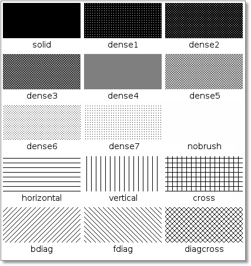

All SeisComP3 graphical user interfaces are based on a common libraries.
This chapter describes what configuration and styling options are available for
all GUI applications. The GUI specific configuration options are additional to
the standard application options. Setup the e.g. messaging connection and database
is equal to the CLI (command line interface) applications.

Styling
=======

To adjust the look-and-feel to the host desktop system and the personal taste
several styling options are available. Since all GUI applications are using the
Qt4 library the tool "qtconfig-qt4" can used to adjust the widget theme and the
colors. If KDE is used as desktop system the same style is used since KDE
bases on Qt as well.

The style options supported by SC3 (and not covered by the general Qt setup)
have to be given in the applications (or global) configuration file. The
parameters are prefixed with *scheme.*.

Configuration syntax
====================

Beside the usual integer, float, boolean and string parameters GUI applications
support also color, color gradient, pen, brush and font parameters. The syntax
is explained below:

Colors
------

.. code-block:: sh

   color = RRGGBBAA | "rgb(red,green,blue)" | "rgba(red,green,blue,alpha)"

Colors are specified either in a hexadecimal notation or in a rgb(a) notation.
When using the rgb(a) notation it should be quoted. Otherwise the configuration
parser would tokenize the value into 3 or 4 strings due to the comma.

Color gradients
---------------

.. code-block:: sh

   gradient = 1:FF0000, 2:00FF00, 3:0000FF

This defines a gradient from red through green to blue for the nodes 1, 2 and 3.
Values out of range are clipped to the lower or upper bound.

Fonts
-----

.. code-block:: sh

   # The font family
   font.family = "Arial"

   # Point size
   font.size = 12

   # Bold?
   # Default: false
   font.bold = false

   # Italic?
   # Default: false
   font.italic = false

   # Underline?
   # Default: false
   font.underline = false

   # Overline?
   # Default: false
   font.overline = false

An example to configure the SC3 base font:

.. code-block:: sh

   scheme.fonts.base.family = "Arial"
   scheme.fonts.base.size = 10

Pens
----

Pens are used in the vector layer configuration. Pens have three attributes:
color, style and width. Color follows the described color definition, width
is a double and the styles are:

+------------------------------------+---------------------------------------+------------------------------------------+
| .. figure:: media/gui/pen-no.png   | .. figure:: media/gui/pen-solid.png   | .. figure:: media/gui/pen-dot.png        |
+------------------------------------+---------------------------------------+------------------------------------------+
| nopen                              | solidline                             | dotline                                  |
+------------------------------------+---------------------------------------+------------------------------------------+
| .. figure:: media/gui/pen-dash.png | .. figure:: media/gui/pen-dashdot.png | .. figure:: media/gui/pen-dashdotdot.png |
+------------------------------------+---------------------------------------+------------------------------------------+
| dashline                           | dashdotline                           | dashdotdotline                           |
+------------------------------------+---------------------------------------+------------------------------------------+
| *Images from Qt 4.1 documentation: http://doc.qt.digia.com/4.1/qt.html#PenStyle-enum*                                 |
+------------------------------------+---------------------------------------+------------------------------------------+

Example:

.. code-block:: sh

   # Blue dotted pen
   pen.color = 0000ff
   pen.style = dotline

Brushes
-------

Brushes are also used in the vector layer configuration. Brushes are used to
fill a polygon. They have two attributes: color and style. Color follows the
described color definition and styles are:

Example:

.. code-block:: sh

   # Red solid brush
   brush.color = ff0000
   brush.style = solid

Map vector layers
=================

SeisComP3 supports drawing of arbitrary polygons/polylines. Currently the FEP
(:file:`share/fep` or :file:`~/.seiscomp3/fep`) and BNA (:file:`share/bna` or
:file:`~/.seiscomp3/bna`) data sets are loaded and may be visualized. While the
FEP layer is configured through the layer 'fep', the layer (resp. category) of
the BNA data is derived from the directory structure of the BNA folder.

In fact the depth of the BNA directory tree is arbitrary and subfolders form
subcategories.

E.g. the directory tree :file:`bna/coastline/europe/germany` will generate
the categories coastline, coastline.europe and coastline.europe.germany which
all may be configured individually. Every undefined property is inherited from
the parent category.

Each data set directory and subdirectory is scanned for an optional
:file:`map.cfg` configuration file defining default drawing options. Available
configuration parameters are described further below. This allows easy
distribution of data sets and drawing properties without the need to change
application configuration files.

The default drawing options may be overridden in the global or application
configuration file using the format *prefix.category.param*. If global layer
properties are configured then just *prefix.param*. The prefix for layer
configuration is *map.layers*. Due to its recursive structure the configuration
options are not available through scconfig.

Available configuration parameters are:

.. confval:: visible

   Type: *boolean*

   Show/hide the layer
   Default is ``true``.

.. confval:: drawName

   Type: *boolean*

   Draws the segment name in the center of the bounding box. For segments read
   from BNA files the name is extracted from the first part of the header.
   Default is ``false``.

.. confval:: rank

   Type: *int*

   Set or override the rank of the segment. The rank defines
   the zoom level at which drawing of the segment starts. For
   segments read from BNA files the name is extracted from the
   second part of the header if it has the form "rank VALUE",
   e.g. rank 12.
   Default is ``1``.

.. confval:: roughness

   Type: *int*

   Sets the roughness of a polyline or polygon while zooming. The roughness
   is somehow defined in pixels and removes successive vertices if the distance
   in pixel is less than roughness. The higher the value the less vertices
   a rendered polyline or polygon will finally have and the faster the rendering.
   If set to 0 then the feature is disabled.
   Default is ``3``.

.. confval:: symbol.size

   Type: *int*

   In case of single points, this specifies the size of the symbol in pixels.

   Default is ``8``.

.. confval:: symbol.shape

   Type: *string*

   In case of single points, this specifies the shape of the symbol. Valid
   values are *circle* and *square*.

   Default is ``circle``.

.. confval:: debug

   Type: *boolean*

   If enabled, the bounding box of the segment is drawn.
   Default is ``false``.

.. confval:: pen.width

   Type: *double*

   Pen width.
   Default is ``1.0``.

.. confval:: pen.color

   Type: *color*

   Pen color.
   Default is ``000000ff``.

.. confval:: pen.style

   Type: *string*

   Line style. Supported values are: dashdotdotline, dashdotline, dashline,
   dotline, nopen and solidline.
   Default is ``solidline``.

.. confval:: brush.color

   Type: *color*

   Fill color.
   Default is ``000000ff``.

.. confval:: brush.style

   Type: *string*

   Fill style. Supported values are:
   nobrush, solid, dense1, dense2, dense3, dense4,
   dense5, dense6, dense7, horizontal, vertical,
   cross, bdiag, fdiag and diagcross.
   Default is ``nobrush``.

.. confval:: font.size

   Type: *int*

.. confval:: font.family

   Type: *string*

.. confval:: font.bold

   Type: *boolean*

.. confval:: font.italic

   Type: *boolean*

.. confval:: font.underline

   Type: *boolean*

.. confval:: font.overline

   Type: *boolean*

Example:

.. code-block:: sh

   # Set global layer boundary color to black
   map.layers.pen.color = 000000

   # Set coastline boundary color to orange and pen width to 2
   map.layers.coastline.pen.color = ff8000
   map.layers.coastline.pen.width = 2

   # Set boundary of Germany to red. Pen width is still 2 (inherited from
   # coastline)
   map.layers.coastline.europe.germany = ff0000

   # Set river color to blue
   map.layers.river.pen.color = 0000ff
