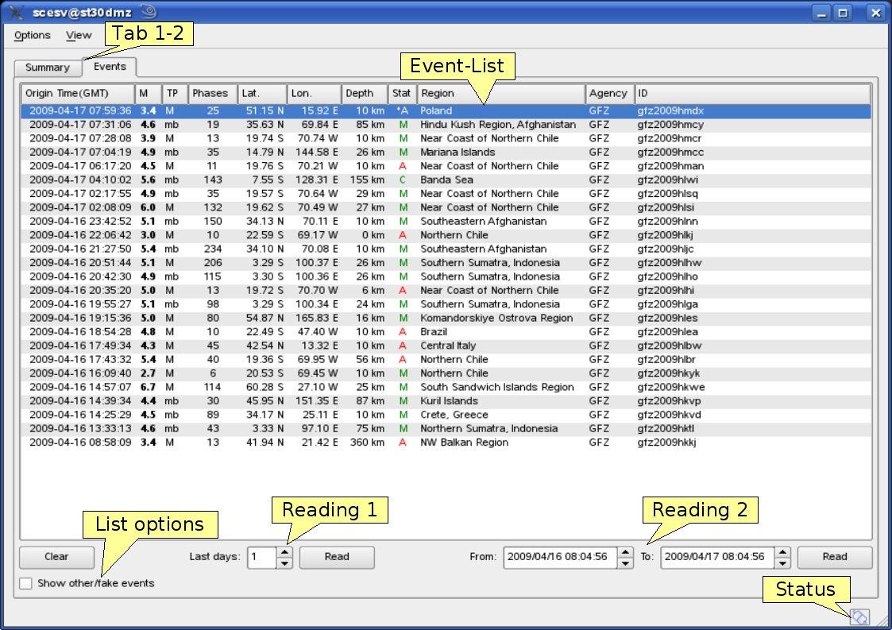
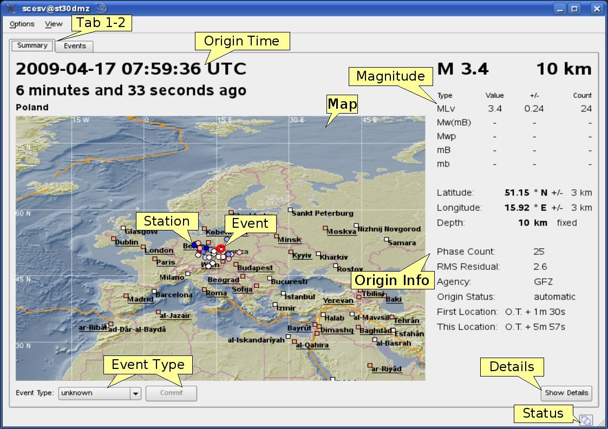

scesv is the the summary display of the event parameters. It shows the primary information
about the current event including location, time, strength, type and processing status.
Additional to the current event also older events can be chosen from the eventlist in the
events tab.

The two tabs of scesv are shown in :ref:`fig-events` and :ref:`fig-summary`.
The events tab shows the eventlist of the time span defined on the bottom side of the window.

.. _fig-events:

   Eventlist tab

   Tab1-2: Summary/Events tab, EventList: list of the last events with summarized information,
   List options: Show fake events, Reading 1: spinbox to limit timespan of displayed events (in days),
   Reading 2: spinboxes to limit timespan of displayed events (specified dates), Status: connection status

The actual (default) or selected event (from eventlist) is shown in the (:ref:`fig-summary`).
Here the information are highlighted in four sections:

====================  =====================================================
section               description
====================  =====================================================
Time                  orign time in UTC and relative to now
Region                a map of the region and location with the event and stations
Magnitude             different magnitude types, the values and counts
Hypocenter            origin information with location, depth, azimuthal gap etc.
====================  =====================================================

|

.. _fig-summary:

   Summary tab

   Tab1-2: Summary/Events tab, Origin Time: origin time in UTC and relative to now, Map: map with region
   and location and stations, Magnitude: different magnitude types with values and counts,
   Origin Info: hypocenter information with position, phase count and azimuthal gap,
   Event: earthquake location, Station: station with ray-path, Details: "Show Details" button to open
   detailed information in :ref:`scolv`, Event Type: event type combo box to set event type, Status: connection status

Hotkeys
=======

=============  =======================================
Hotkey         Description
=============  =======================================
:kbd:`F2`      Setup connection dialog
:kbd:`F6`      Show propagation of P and S wave
:kbd:`F8`      Toggle auto update
:kbd:`F9`      Show raypaths and associated stations
:kbd:`F10`     Toggle tabs
:kbd:`F11`     Toggle fullscreen
Mouse wheel    Zoom map in/out
Double click   Center map
=============  =======================================
