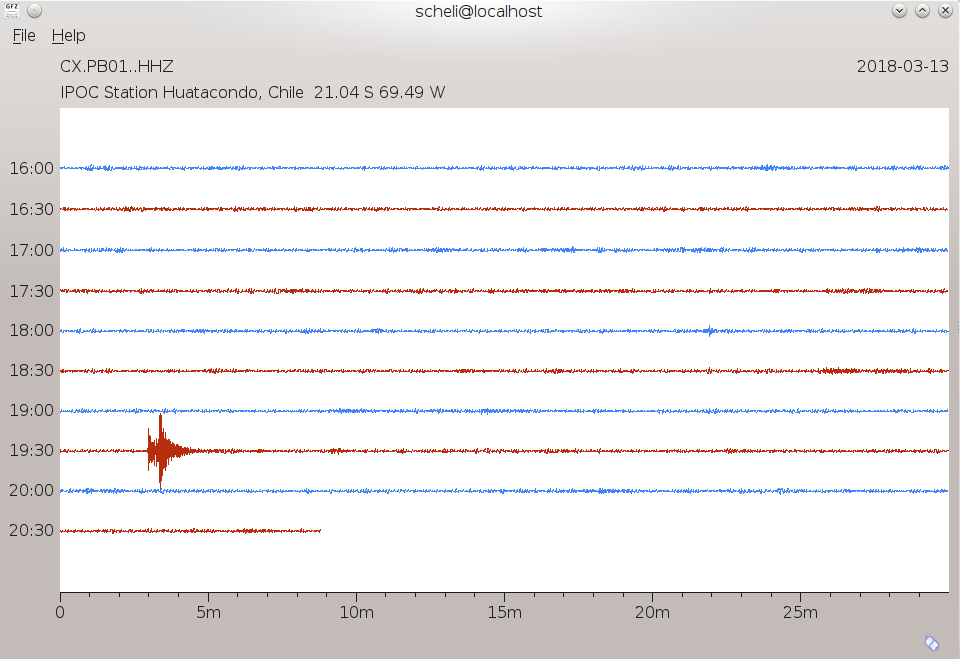

scheli visualizes waveforms from a single station mimicking a drum-recorder plot
(see :ref:`fig-scheli`).

Features
========

* scheli plots configurable traces in helicorder style
* Configurable GUI: trace colors, visualized time spans, number of rows, data filtering,
  amplitude ranges and much more.
* Automatic image capture: capture helicorder images at configurable time intervals
  and a set of channels

.. _fig-scheli:

   scheli

Examples
========

.. _scheli-show:

**Simple helicorder window:**

Let :ref:`scheli` show data from the CX station PB01 for the previous 5 hours.

.. code-block:: sh

   scheli --stream=CX.PB01..HHZ --rows 10

.. _scheli-capture:

**Image capture:**

Capture the helicorder plot for 3 stations in intervals of 10 seconds.
The data is retrieved using seedlink and the plots are stored as PNG images.
The image files are named according to network, station, stream and location codes
of the requested stations.

.. code-block:: sh

   scheli capture --heli.streams="CX.PB01..HHZ,CX.PB02..HHZ,CX.PB04..HHZ" --interval=10 -o "/tmp/heli_%N_%S_%L_%C.png" -H localhost -I slink://localhost

Setup
=====

Colors of traces etc. can be adjusted by setting the *scheme* parameters in
the global configuration of scheli. For alternating colors between the traces
set the parameters scheme.colors.records.foreground and
scheme.colors.records.alternateForeground in scheli.cfg, e.g. as for the example
in the figure :ref:`fig-scheli`:

.. code-block:: sh

   # The general color of records/traces.
   scheme.colors.records.foreground = 4286F4

   # A general trace color of the alternate trace (eg scheli).
   scheme.colors.records.alternateForeground = B72D0E
