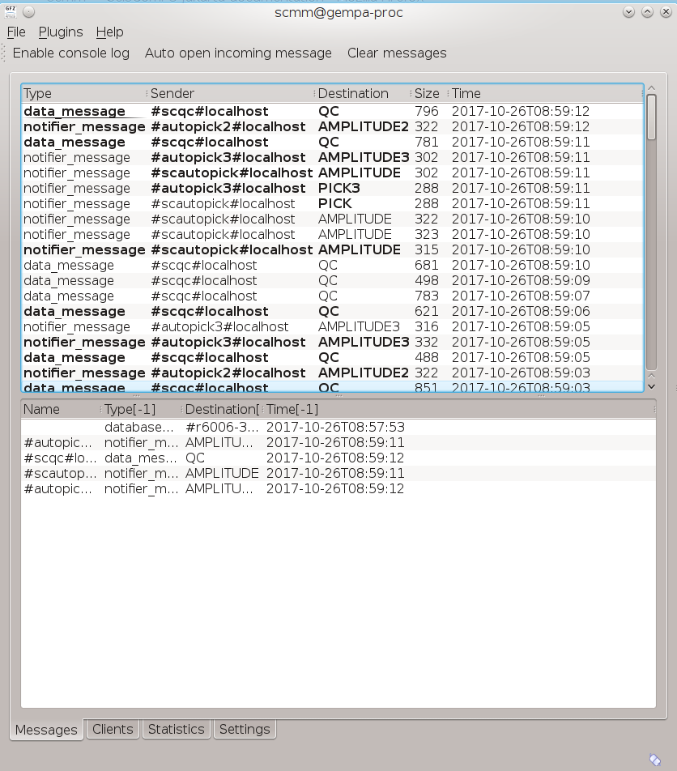
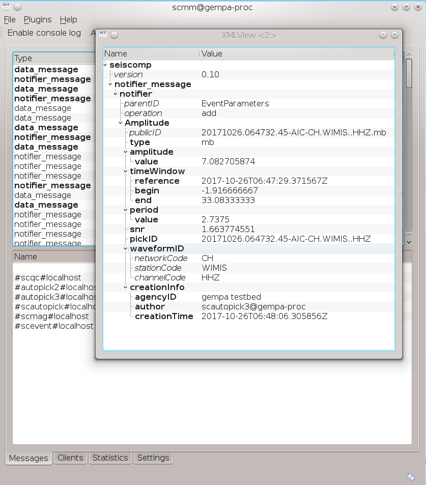
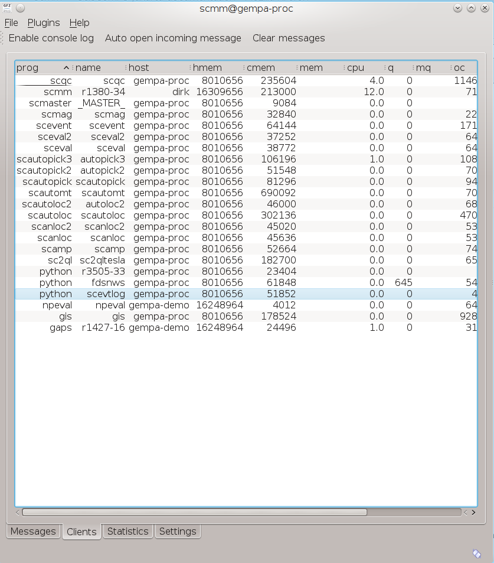

**scmm** is the messaging monitor, the graphical interface to :ref:`scm`. It allows to
view the messages from all modules sent around by the SeisComP3 messaging system.
Therefore, **scmm** can be used to debug configured message groups and module
connections, e.g. in a system with several processing pipelines and specific
message groups.

In addition, **scmm** allows to view the content of single messges
as well as the memory consumption and other statistics of all modules connected
to the SeisComP3 messaging system.

   View message notifications.

   View the message content by clicking on individual messages.

   View module memory consumptions.

.. figure:: media/scmm_statistics.png
   :width: 8cm

   View module statistics.
