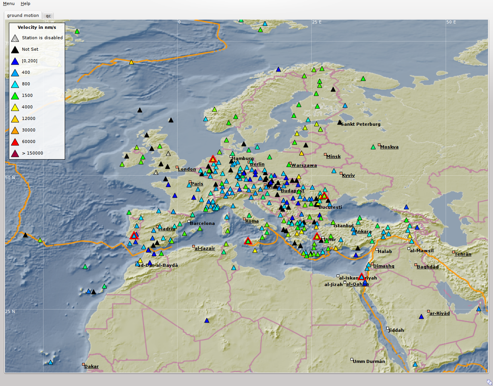
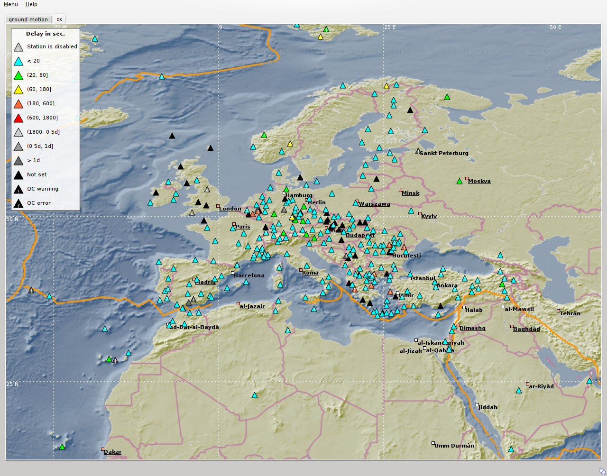
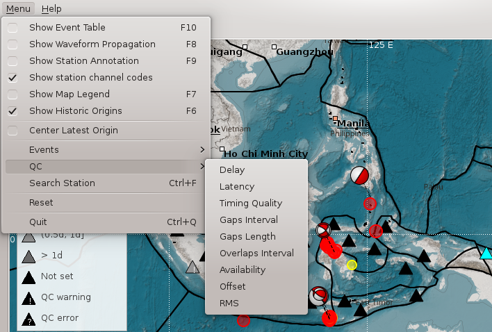
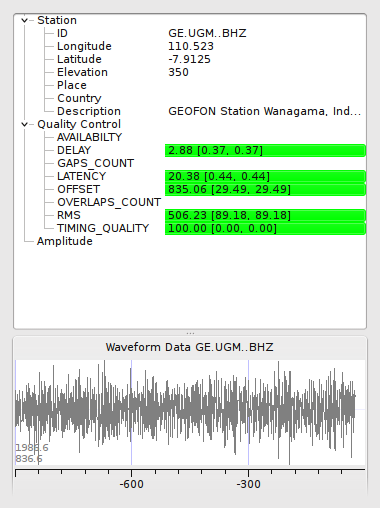
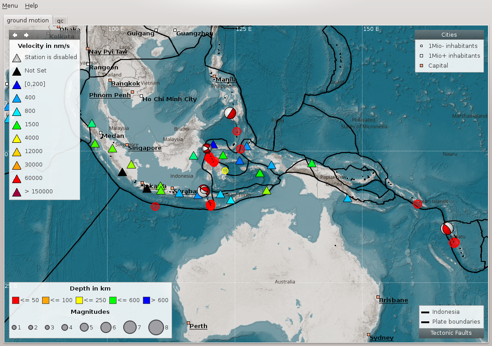
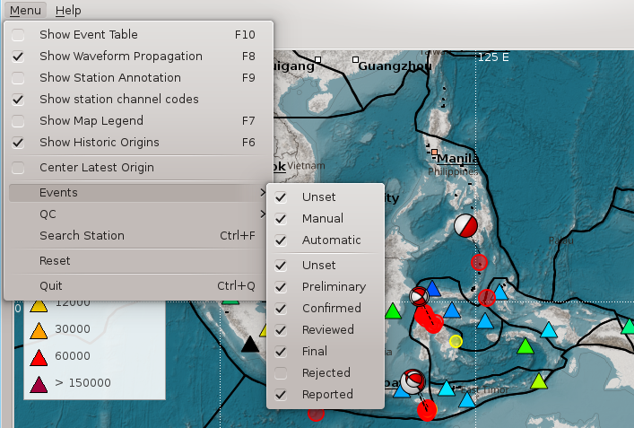
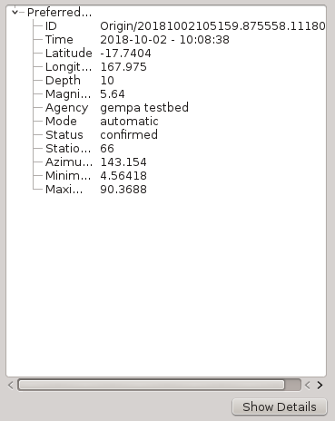

scmv visualizes the actual information regarding earthquakes, trigger status,
ground motion and station quality. This information is visualized in a map
showing also the topography of the region including bathymetry, state borders
and geologic faults. scmv provides two different tabs with maps showing the
ground motion and the network status.

Ground motion status
--------------------

The ground motion tab (fig. :ref:`fig-scmv-gm`) shows the actual groundmotion
in nm/s at each station color-coded. Furthermore the trigger status (new picks)
of the stations are announced by blinking triangles (the same in all
other tabs). In case a new pick is associated to an event, the blinking color
changes from red to green (default). Events are represented by open circles
and the depth is color-coded. By right mouse click on the symbol of a station
more detailed information are shown in an information widget (fig. :ref:`fig-scmv-infowidget`).

.. _fig-scmv-gm:

   Ground motion tab

   Tab 1-2 = Ground Motion, Network Status tab; Station A = station with ground
   motion between 0 and 200 nm/s; Station B = triggering (red blinking) station;
   Station C = station of undefined status; Station D = triggering and associated
   station (green blinking); EQ = location of the earthquake/event; P = spreading
   of the P-wave; S = spreading of the S-wave; Legend = ground motion scale.

Network status
--------------

The network status tab (fig. :ref:`fig-scmv-netstat`) visualizes the quality control
parameters of all shown stations. The colors of the triangles represent the data
the selected parameters of a station, e.g. latency or delay. More detailed information about station quality
can be derived by opening an information widget (fig. :ref:`fig-scmv-infowidget` left)
with a right mouse click on the symbol.

.. _fig-scmv-netstat:

   Network status tab

   Station A = station with up to 20 sec data latency/delay;
   Station B = station with up to 10 min data latency/delay and a warning;
   Station C = disabled station;
   EQ = location of a recent or historic earthquake/event;
   Legend = scale of the delay;
   Status = connection status.

The visualized QC parameters can be selected in the QC parameters widget of scmv.

.. _fig-scmv-qc-select:

   QC parameters selection widget

The station information widget opens by right mouse click on a station symbol
in one of the scmv maps. The widget gives a more detailed list of parameters.
For a station general information (coordinates, network code etc.), quality
parameter (latency, gaps etc.), amplitude information and the actual waveform
data are provided. For an event information like the location, the number of
stations and the azimuthal gap are shown.

.. _fig-scmv-infowidget:

   Station information widget

The info widget of a station shows station information like network code
and location. The quality of the station can be checked here. The lower
part shows the last 15 minutes of waveforms including picks (if available).

Event information
-----------------

In addition to the current event scmv also shows all events it has currently
saved in its session as circles. This depends on the configured time span it remembers
events. Showing the events can give a convenient overview of the network activity.
If available focal mechanisms are displayed with dashed lines connecting to their location.
The circles and focal mechanisms are again colored by their depth and sized by
magnitude.

.. _fig-scmv-historic-origins:

   Show historic origins

   All historic origins currently saved in scmv are shown as circles.

The events shown an the map can be confined by selecting the mode and the status
of preferred origins in the event selection widget.

.. _fig-scmv-event-select:

   Event selection widget

The event information widget opens by right mouse click on an event symbol.
It shows event details.
Clicking on the "Show Details" button allows to open the preferred origin of
the event in other GUIs such as in scolv.

.. _fig-scmv-event-info:

   Event information widget

Hotkeys
=======

=====================  ========================================
Hotkey                 Description
=====================  ========================================
:kbd:`F2`              Setup connection dialog
:kbd:`F3`              Toggle ray paths and associated stations
:kbd:`F6`              Hide propagation of P and S waves
:kbd:`F7`              Toggle legend
:kbd:`F8`              Toggle historic origins
:kbd:`F9`              Toggle station annotation
:kbd:`F10`             Toggle event list (event tab)
:kbd:`F11`             Toggle full screen mode
:kbd:`CTRL + f`        Seach station
:kbd:`Arrows`          Move focus
Mouse wheel            Zoom in or out
Double click           Center map
Right mouse button     Open info widget
Mid mouse button       Set preliminary origin
=====================  ========================================

Use cases
=========

Get station information
"""""""""""""""""""""""

- Position the mouse above a triangle representing a station.
- Click the right mouse button for opening the station info widget.
- Choose one station in case several stations are in the selection range.

Get event information
"""""""""""""""""""""

- Position the mouse above a circle representing a location of an event.
- Click the right mouse button for opening the event info widget.
- Choose one event in case several events are in the selection range.

Set preliminary origin
""""""""""""""""""""""

- Position the mouse in the map
- Press the middle mouse button
- Set date & time and latitude, longitude & depth
- Press "Create" to open the origin in another GUI, e.g. scolv.

  .. image:: media/scmv/artificial-origin.png
     :width: 4cm

Search station/network
""""""""""""""""""""""

- Press :kbd:`CTRL + f`
- Type station/network name
- Double click in a station in the list to center the map at this location
