scolv is the main interactive tool to revise or review the origin information
such as picks, location, depth, time, magnitudes and event association.
Therefore scolv is divided into five logical units (tabs):

- :ref:`Location <fig-scolv-location>`
- :ref:`Magnitudes <fig-scolv-magnitudes>`
- :ref:`Event <fig-scolv-event>`
- :ref:`Events <fig-scolv-events>`
- :ref:`Picker <fig-scolv-picker>`

scolv provides the whole functionality to review and revise earthquake
parameters.

Units and digits
================

Local network users prefer the distance unit in kilometres while others prefer degrees.
scolv (as any other GUI) can be configured to show either the one or the other.

.. code-block:: sh

   # If true, show distances in km. Use degree otherwise.
   scheme.unit.distanceInKM = true

Furthermore the precision of various values can be configured:

.. code-block:: sh

   # Precision of depth values.
   scheme.precision.depth = 0
   # Precision of latitude/longitude values.
   scheme.precision.location = 2
   # Precision of magnitude values.
   scheme.precision.magnitude = 2
   # Precision of pick times (fractions of seconds).
   scheme.precision.pickTime = 1

Summary widget
==============

The summary widget contains two tabs: *Preferred* and *Current*. *Preferred*
reflects the current official (database) state of the event while *Current*
shows the current solution (location and magnitudes).

Plots
=====

Some tabs in scolv are for plotting data (e.g. arrival residuals). Each plot
is also interactive to select a subset of data or to zoom into a region.

A plot filter can be defined. Filtering means that arrivals that match the
filter are not plotted. They are filtered out visually. To enable a filter
click the link "not active" right below the plot tabs. A setup window pops up
where the filter can be defined. Currently only a filter by azimuth around
epicenter can be applied.

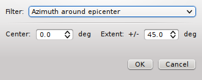

Select the center azimuth and the extent to either side. If OK is pressed all
arrivals that fall outside the defined azimuthal area are hidden from the plot
and the line below the tabs turns into "Filter is active". Clicking on the
link again and select the "None" filter will show all arrivals in the plot again.

The plot can also be configured to show dashed grid lines. The new default is on.

.. code-block:: sh

   # Switch of grid lines by default
   olv.drawGridLines = false

Location tab
============

The Location tab shows detailed information of the associated
phases and the residuals from the chosen origin additional information about the
hypocenter, time, station distribution, helps to find outlier.

.. _fig-scolv-location:

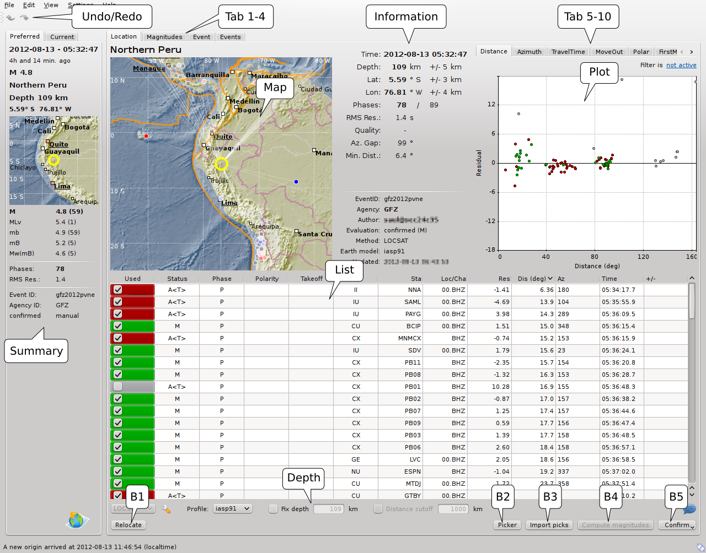

   Location tab of scolv.

   (**Redo/Undo**) Switch to last/next location result
   (**Tab 1-4**) Location/Magnitude/Event/Events tab
   (**Map**) map with the event location, associated stations, the color coded
   residuals (red-positive, blue-negative) and ray paths
   (**Information**) Origin information including time, epicentre, depth, number of
   used and available phases, RMS, azimuthal gap and minimum
   station distance
   (**List**) Table of associated arrivals (phases) containing stream information
   and phase information
   (**Tab 5-10**) Arrival residual plots against distance and azimuth (linear and
   polar) in a separate tab
   (**Plot**) Arrival residual plot (distance over residual in seconds)
   (**Depth**) Checkbox to fix to a defined depth
   (**B1**) Relocate with the given arrival information
   (**B2**) Open Manual Picker
   (**B3**) Import picks of other automatic origins belonging to the same event
   (**B4**) Compute magnitudes
   (**B5**) Commit origin
   (**Summary**) all information of the preferred origin of the loaded event

The default arrival residual plot is shown in the figure above. Additional 4
plots are available to analyze arrivals which can be shown by activating the
corresponding tab.

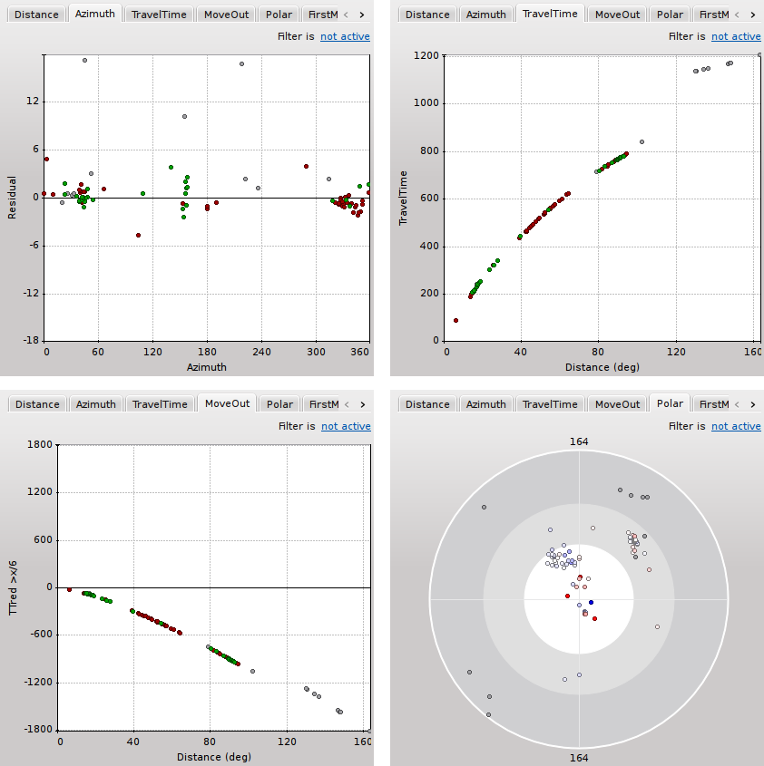

   Additional arrival plots

   From upper left to lower right: **1**) azimuth vs distance, **2**) travel time vs distance,
   **3**) travel time - predicted travel time vs distance, **4**) azimuth vs distance polar

The move out plot uses the reduced travel time with a default reduction velocity
of 6km/s. This value is configurable, either in the configuration file or in
the settings window.

.. code-block:: sh

   # Reduction velocity used for move out plot
   olv.Pvel = 6.0

When an event is relocated new magnitudes can be calculated by using the
"Compute Magnitudes" button. The advantage of calculating the magnitudes before
committing the new origin, is the possibility to check the resulting magnitudes
before they are computed manually by :ref:`scmag`.

.. _fig-scolv-location-mag-status:

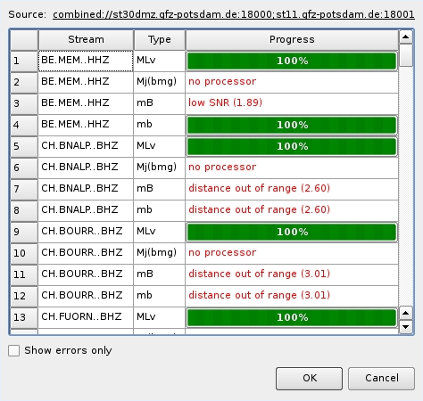

   Compute magnitudes status window

:ref:`A window <fig-scolv-location-mag-status>` will pop up giving the progress
information of computation. The amplitudes are either fetched from database if
the pick is unchanged and already in the system. For new manual picks,
waveforms are requested to compute the amplitudes. The popup window contains
information about the progress and possible errors. After closing this windows
all available magnitudes are shown in the magnitudes tab (see next section).

Arrival table
-------------

The arrival table shows all arrivals of the current origin. The columns are
sortable by clicking on the corresponding header item. Additional data columns
can be shown or active columns can be hidden, either initially or interactively.
Available column identifiers are:

* **Used**
* **Status**
* **Phase**
* Weight
* Method
* Polarity
* **Net**
* **Sta**
* **Loc/Cha**
* **Res**
* **Dis**
* **Az**
* **Time**
* **+/-**
* Created
* Latency

whereas only the columns printed bold are shown initially. The initial column
list can be changed in :file:`scolv.cfg`:

.. code-block:: sh

   olv.arrivalTable.visibleColumns = Used, Status, Weight, Phase, Net, Sta,\
                                     Loc/Cha, Res, Dis, Az, Time, +/-

The user can also interactively select what columns are be visible or hidden
from a context menu which pops up after a right click on the table header.

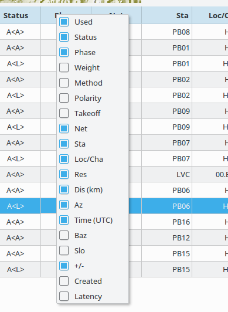

The checkbox in the first column indicates if the arrival was used for locating the
origin. The overall usage state of arrival contains three flags: arrival time used,
backazimuth used and slowness used. If any of these flags is active then the
overall usage state is active as well. The arrival table shows those flags indicated
by **T** for pick time, **S** for horizontal slowness and **B** for backazimuth.
A flag is rendered with a dash if the referred pick does not contain the
corresponding feature. For example, if a pick does not carry a backazimuth
measure then the backazimuth flag is disabled. It would not make sense to
activate backazimuth usage without a corresponding measure.

In most cases, only the time flag, indicated by the capital **T**, will be active.
The other two flags are rendered with dashes, meaning that they are inactive.
Background: an arrival refers to a pick which can hold several features. The basic
feature a pick must hold is the pick time. Some modules such as for array processing
might compute additional pick features. Such features can be the backazimuth and
the horizontal slowness. Locators like LocSAT were developed to use those features
to increase the precision of a location. Special applictions are locations based
borehole networks with poor azimuthal coverage or locations with very few stations.

There may be cases where a backazimuth measure of a pick should not be used by
the locator. In contrast, if a backazimuth is available but the timing is bad,
disabling the use of the pick time but including the backazimuth may be advantageous.
For that a simple weight value is not enough. With a weight one cannot separate
whether or not to use a particular feature. So the arrival does not only refer
to a pick but holds flags indicating which features of that pick should be used
for locating.

.. figure:: media/scolv/arrival-flags.png

Single or multiple rows can be selected in the table. The selection of multiple
rows works either with Ctrl+LeftMouse (add single row) or
Shift+LeftMouse (range selection).

When pressing the right mouse button on a selected row a context menu pops up.
If an unselected row is used, the current selection will be reset and only the
row below the mouse is selected.

The context menu allows to:
* select arrivals based on a certain criterion
* activate/deactivate selected pick features
* delete selected arrivals
* rename phases of selected arrivals

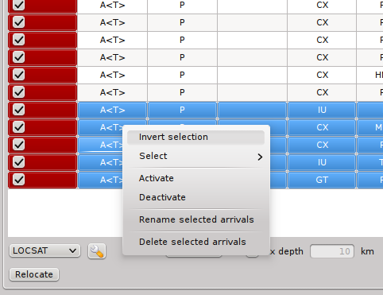

If arrivals are deleted, they are removed physically from this solution in
contrast to deactivate an arrival where only the used flags are set to zero.

Waveform review (Picker)
------------------------

The *Picker* button opens the interactive waveform picker window. It allows
to pick additional phases, to confirm picks, to add additional pick information
such as polarity and uncertainty, to rotate traces and much more.

It is divided into two parts, the zoom trace and the trace list. The zoom trace
shows a sub area of the active trace in the list.

.. _fig-scolv-picker:

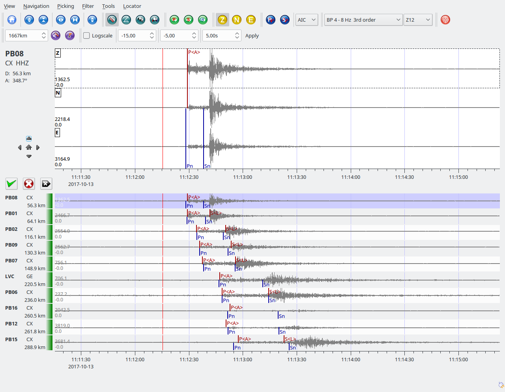

Initially the picker shows only the vertical channels for each station that
have been associated with the current location. It can be
:ref:`configured <scolv-settings>` to show all three components.

Initially the picker allows to pick the following phases:

- P
- Pn
- Pg
- pP
- S
- Sg

This list can be customized and phases can be grouped to reflect e.g. regional
and teleseismic profiles. An example configuration looks like this:

.. code-block:: sh

   # Define two phase groups: regional and teleseismic
   picker.phases.groups = regional, teleseismic

   # Define all phases of group "regional"
   picker.phases.groups.regional = Pn, P, Pg, PmP, P1, Sg, S, Sn, SmS

   # Define all phases of group "teleseismic"
   picker.phases.groups.teleseismic = pP, PKP, PKP

   # Define a list of favourite phases for quick access
   picker.phases.favourites = Pn, P, Pg, PmP, P1, Pg, Sg, S, Sn, SmS

The list of favourites is used to assign shortcuts to. :kbd:`1` is assigned
to the first phase, :kbd:`2` to the second and so on.

.. note:: Shortcuts are assigned only  to the first 9 favourite phases. All
   other defined phases can be activated from the *Picking* menu.

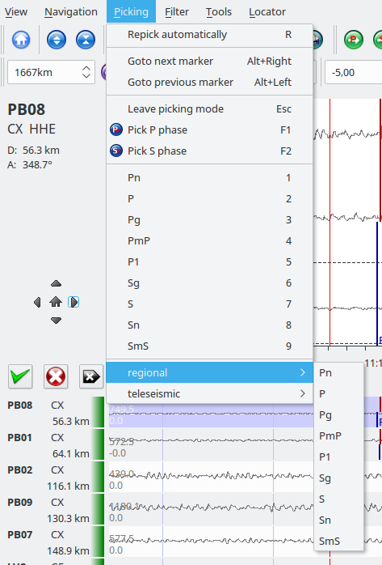

   Pick phase selection menu

To set the uncertainty of a pick a list of predefined uncertainties can be
defined. Additionally uncertainties can be defined freely whereas choosing
among a predefined set of uncertainties is a lot faster.

If the mouse hovers a pick a dashed rectangle is drawn around this pick. Then
the pick is active and the right mouse button can be pressed to open the context
menu where the polarity and uncertainty can be defined. The following screen shot
shows the available uncertainties.

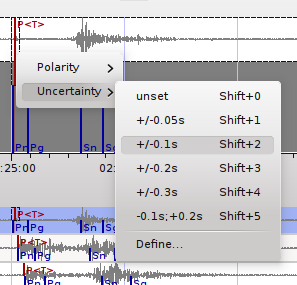

   Pick context menu

They can be configured in scolv.cfg with:

.. code-block:: sh

   # Define available pick uncertainty profiles. Single values
   # are symmetric uncertainties whereas tuples are asymmetric
   # uncertainties: (left,right). Uncertainty values are given
   # in seconds.

   # Define an uncertainty profile for local events
   picker.uncertainties.profile.local = 0.05, 0.1, 0.2, 0.3, "(0.1,0.2)"

   # Define an uncertainty profile for teleseismic events
   picker.uncertainties.profile.teleseismic = 0.5, 1, 2, 3, "(1,2)"

   # Define the list of uncertainty sets that are active in scolv.
   # This first set in the list is used by default. The other sets
   # can be activated in the settings dialog (scolv: F3)
   picker.uncertainties.preferred = local, teleseismic

If an uncertainty is selected the active pick is copied into a manual pick
and the uncertainty is displayed as semi transparent bar to the left and
to the right of the pick. The width of the bar corresponds to the uncertainty
in seconds.

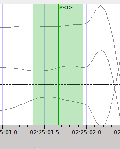

Furthermore the pick polarity can be defined.

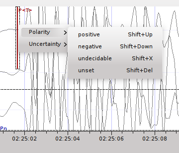

Either *positive*, *negative*, *undecidable* or *unset*. If set it is displayed
as an arrow. *Undecidable* is displayed as a cross (X).

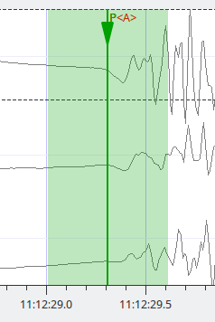

To rotate the waveform components into ZNE or ZRT system a new drop down list
was added in the toolbar. Selecting either ZNE or ZRT implies that all missing
components are requested.

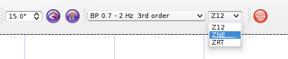

When waveforms are requested the corresponding widget background is changed
according to the current state:

- yellow: waveforms requested but not yet received
- red: acquisition finished and data is not available
- green: waveforms received and acquisition still in progress

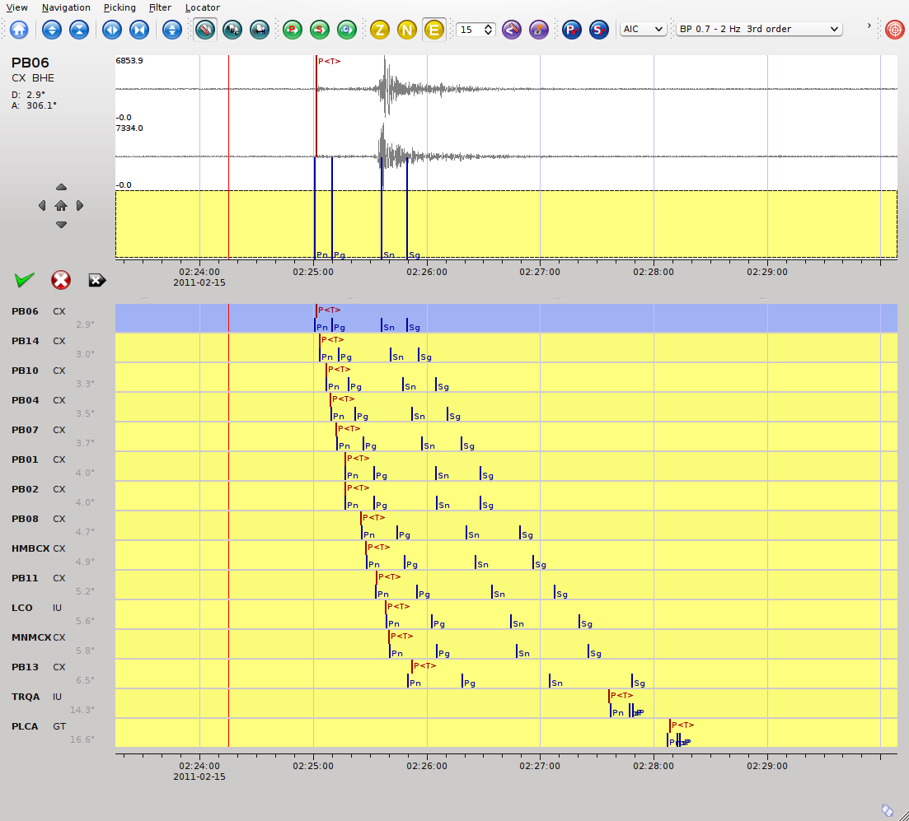

If a trace displays all three components and amplitudes are scaled up, they are
not clipped to their window area. The clipping behaviour can be toggled by
either pressing :kbd:`C` or in the menu
:menuselection:`View --> Zoomtrace --> Clip components to viewport`.

The difference is shown in the following two images:

.. figure:: media/scolv/clobber-off.png
   :width: 16cm

   Trace clipping enabled

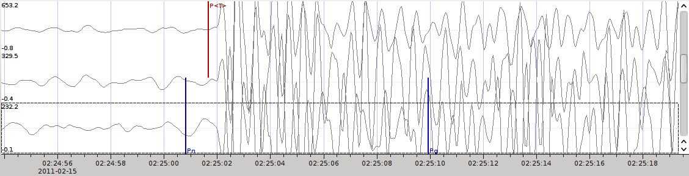

   Trace clipping disabled

Commit a solution
-----------------

Committing a solution means to send the location (including optional magnitudes)
to the processing system and let it decide what origin becomes preferred.

To optimize the workflow

1. select an event
2. review solution
3. commit solution
4. change to event tab
5. set this solution preferred
6. set event type
7. change to events tab
8. goto 1.

to

1. select an event
2. review solution
3. commit solution
4. change to events tab
5. goto 1.

an additional commit mode was added which allows to set certain options along
with the location and its magnitudes.

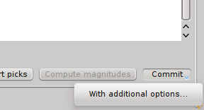

After pressing and holding the Commit button down for a little while, a menu
pops up which allows to select *With additional options*. Selecting this entry
brings up another window where the different options can be set.

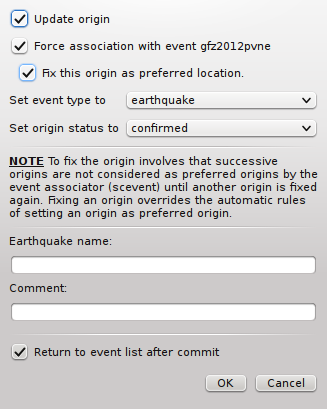

It allows to fix the origin to be committed as preferred origin and to set the
event type in one go. If *Return to event list after commit* is ticked the
event list is activated after pressing OK to select another event quickly.

*Earthquake name*
 Contains the event description *earthquake name*. If this field is empty the
 description will be removed from the event otherwise it will be added.

*Comment*
 contains an optional event comment added as comment with ID *Operator*.

.. _sec-scolv-custom-commit:

As a shortcut for committing with additional options,
:ref:`custom commit buttons <fig-scolv-custom-commit>` can be added by
configuration: Add, enable and configure a custom commit profile in
:confval:`olv.customCommits`.
With custom commit buttons origin and event paramters can be set, e.g.:

* origin status
* fixing the origin
* event type
* event type certainty
* magnitude type of the :term:`preferred magnitude`. The preferred magnitude
  can also be set in the :ref:`magnitude tab <_scolv-sec-magnitude-summary>`.
* event comments

.. _fig-scolv-custom-commit:

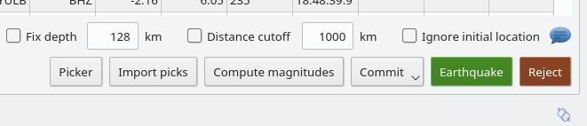

   Custom commit buttons in the Location tab for configured actions and with specific label and color.

Magnitudes tab
==============

The Magnitude tab shows all available magnitude information for the current
origin. They can be recomputed after creating a new origin, e.g. by relocating.

.. _fig-scolv-magnitudes:

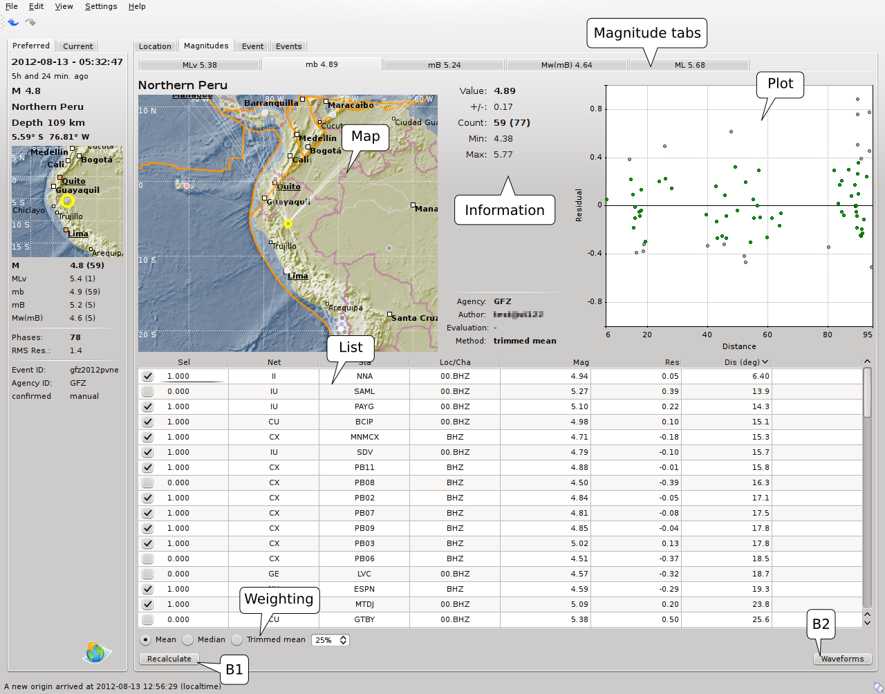

   Magnitudes tab of scolv.

   (**Map**) Map with residual and status of the station magnitude, filled
   circles show stations which delivered a magnitude, empty circles represent
   for which no magnitude was calculated
   (**Magnitude tabs**) Each magnitude and the residuals are displayed in a
   separate tab, no residuals are displayed for deduced magnitudes like
   Mw(mB) or M
   (**Information**) Magnitude information including network magnitude value,
   magnitude error, number of used and available station magnitudes and
   minimum/maximum station magnitude
   (**List**) Station magnitude table with weights
   (**Plot**) Station magnitude residual from network magnitude (distance
   over residual)
   (**Weighting**) Weighting scheme for the network magnitude
   (**B1**) Recalculation of the network magnitudes
   (**B2**) Open waveform review

.. _scolv-sec-magnitude-station:

Station magnitudes
------------------

For each of the different magnitude types (e.g. mb, mB, MLv, Mw(mB)),
the station magnitudes are shown in the magnitude residual plot and the table.
The residual plot visualizes the difference between the station magnitude and
the network magnitude for the different station distances. After relocation the
magnitudes can be recalculated by the "Compute Magnitudes" button in the
Location tab.

The station magnitudes can also be recalculated by
:ref:`interactive waveform analysis<scolv-sec-amplitude-review>`. Press the B2 button to
start the interactive analysis.

.. important:: Magnitudes cannot be recalculated for origins loaded from
   database. To review magnitudes, create a new origin (relocate), recompute
   magnitudes and then change into this tab to open either the waveform
   review window or to just remove outliers.

.. _scolv-sec-magnitude-network:

Network magnitudes
------------------

Station magnitudes can be selected or unselected in the list and in the plot of
station magnitudes for computating the
corresponding network magntiude. The method and the margins to disregard outliers
can be selected.
Normally, the 25%-trimmed mean is calculated as network magnitude to stabilize
the result against a few outliers.

Magnitudes that were not computed due to missing data or low signa-to-noise
ratios have a cross button rendered in their tab headers and their value is
nan (not a number). Furthermore was the status of the magnitude set to
rejected. To manually review the waveforms and to fine tune the
parameters, open the waveforms and add at least one station magnitude. Otherwise
the rejected magnitude will be removed from the origin prio to committing it. 

.. _scolv-sec-magnitude-summary:

Summary magnitude
-----------------

The summary magnitude typically is calculated from all network magnitudes
by :ref:`scmag` and set as preferred magnitude type by :ref:`scevent` after committing
or confirming an origin. The defaults can be changed by configuring :ref:`scmag`
and :ref:`scevent`.

However, in combination with :ref:`custom commit buttons <sec-scolv-custom-commit>`,
the network magnitude to be considered as the preferred can be set by hitting this
configured button or interactively in the :ref:`magnitude tab <fig-scolv-magnitudes>`
of scolv. Interactively check the box in the network magnitudes tab, then press the
custom commit button. Setting the preferred magnitude interactively in the magnitude
tab takes priority over the configuration of the custom commit button.

.. _scolv-sec-amplitude-review:

Waveform review
---------------

The magnitude review page also allows the review of waveforms.
The button *Waveforms* brings up the amplitude waveform review page.
The waveform review magnitude type is the same as the currently active tab.

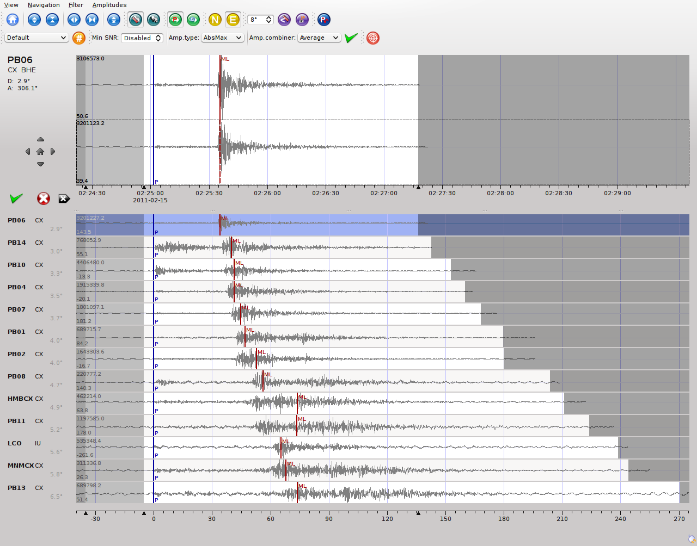

The initial view loads all traces of all arrivals within the defined distance
for that magnitude type. The zoom trace shows all components required for this
particular amplitude type and the lower part shows all stations and only the
currently active component. All traces are aligned on trigger time (blue P marker).
If a station has got an amplitude it shows up as a red (automatic
determined amplitude) or green (manually determined amplitude) marker.
This display is similar to the Picker.

The toolbar contains two lines of settings. The first line is similar to the
Picker, the second line is amplitude picker specific.

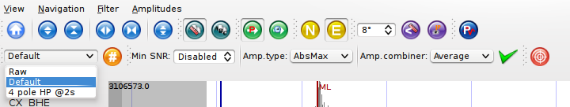

   Second toolbar line: filter selection, filter toggle, min SNR editor,
   amplitude measurement type selector, amplitude combiner selector,
   (re)calculate amplitudes, apply amplitudes.

A station trace is divided into three areas:

- dark gray: unused data
- light gray: data used for noise offset and noise amplitude
- white: data used for amplitude calculation

The example above shows nicely how different data time windows are used for
amplitude determination depending on the distance. This depends on the
amplitude type and its implementation.

Things that can be done:

- show raw data
- change processing settings
- adjust processing areas (noise, signal) for a single trace or all traces
- apply a secondary filter (e.g. to remove noise or low frequencies)
- pick amplitudes within a user definable time window
- add unpicked/unassociated stations that are within a certain distance
- remove bad stations

Show raw data
^^^^^^^^^^^^^

By default the processed waveforms are displayed. To look at the raw waveforms
change the filter drop down box to *Raw*.

Processing settings
^^^^^^^^^^^^^^^^^^^

A basic amplitude processor uses two basic settings: Minimum signal/noise
ratio (SNR) and data time windows. The default minimum SNR is defined by the
implementation of the amplitude algorithm. This default SNR is shown in the
toolbar right from *Min SNR:*. In some situations an operator might want to
increase or decrease the minimum SNR for some reason. This can be done by
modifying the value in the corresponding spin box.

In the time scale of the zoom widget and the overview three black triangles are
visible. Those triangles can be used to adjust the data time windows of either
the zoom trace (upper part) or all traces (lower part) by dragging the handle
with the left mouse button.

Some amplitude processors allow the modification of the type of amplitude
measurement (e.g. absolute maximum or peak-to-peak) and/or the amplitude
combiner procedure. This procedure is mostly used when a final amplitude from
two components is computed, e.g. ML on the horizontals. The combiner procedure
defines how the amplitudes of each horizontal are combined to a single amplitude,
e.g. by taking the maximum of both or the average.

If the amplitude processor allows any of these options the corresponding drop
down boxes are enabled in the toolbar and can be used to change the defaults.

.. note:: Amplitudes are not recalculated if any changes to the settings are
   made. Recalculation has to be activated manually (see below).

Secondary filters
^^^^^^^^^^^^^^^^^

Another option is to filter the data additionally to the internal filter of the
amplitude processor. Be warned that wrongly applied filters screw up the results.
The available filters can be defined in the settings dialog of scolv or in the
configuration file similar to the manual picker filters:

.. code-block:: sh

   # Define a list of available filters for amplitude picking in :confval:`amplitude.filters`.
   # The format is "name1;filter-definition1", "name2;filter-definition2"
   amplitudePicker.filters = "4 pole HP @2s;BW_HP(4,0.5)"

The new filter selection is applied immediately to the waveforms while the amplitudes are not recalculated
(see next section).

Calculate amplitudes
^^^^^^^^^^^^^^^^^^^^

To calculate the amplitudes of all traces with the current settings press the
green check in the toolbar. It will process all traces and recalculate the
amplitudes within the shown time windows. If an error occurs it will show up as
a small message box in the station trace itself. If a new amplitude is available
its state is set to manual and the marker is updated to reflect the new position
of the amplitude. If the mouse hovers an amplitude marker a tooltip pops up
after a certain amount of time and shows information about the amplitude.

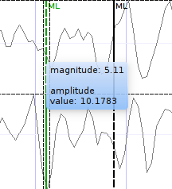

Pick amplitudes
^^^^^^^^^^^^^^^

In addition to the default picking of all stations it is also possible to
define the time window of the amplitude of a station manually. To do so,
activate picking by pressing :kbd:`1` or in the main menu:
:menuselection:`Amplitudes --> Pick amplitudes`.

There are two modes of picking:

 1. create a time window by pressing with left mouse button at the start time and
    releasing at the end time, or
 2. double click at a time and use a time window of [t-0.5sec;t+0.5sec]

Add stations in range
^^^^^^^^^^^^^^^^^^^^^

Unpicked or unassociated stations can be added the same way as in the manual
picker. The new stations will not have an amplitude and need either manual
picking or global amplitude recalculation.

Remove bad stations
^^^^^^^^^^^^^^^^^^^

Stations can be disabled by either double clicking on the trace label in the
overview or by deactivating an amplitude similar to deactivating a pick.

Confirm the amplitudes
^^^^^^^^^^^^^^^^^^^^^^

The red button in the toolbar confirms all amplitudes and transfers them to the
magnitude review page. Only activated amplitudes are transferred. Disabled
stations or disabled amplitudes are ignored. At this stage all magnitudes are
calculated and the network magnitude is calculated according to the available
settings: *Mean*, *Median* or *Trimmed mean*.

Event tab
=========

The Event tab gives all information of associated origins and magnitude of the
actual event. Here the selection of the preferred origin and preferred magnitude
can be influenced independent from :ref:`scevent`. The messaging between
scevent and scolv about the selected origins and magnitudes can be viewed in
a window that has to be opened by pulling the left side frame to the right.

.. _fig-scolv-event:

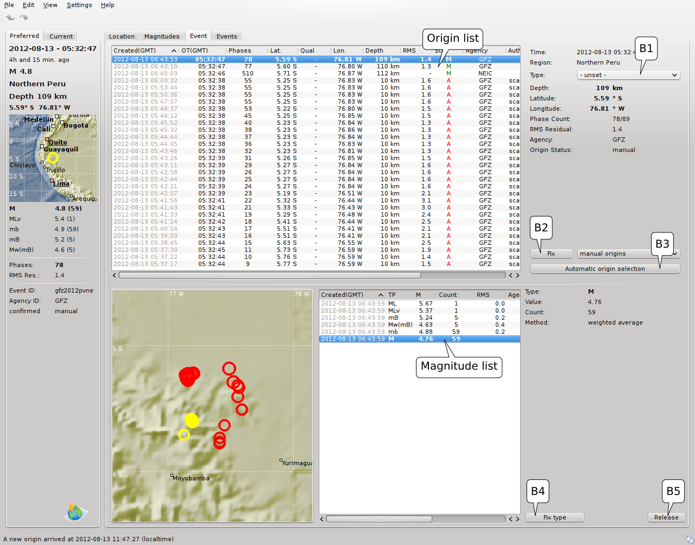

   Event tab of scolv.

   (**Origin list**) List of all associated origins
   (**Magnitude list**) List of magnitudes of the actual origin
   (**B1**) Selector for the event type
   (**B2**) Button to fix the selected origin as preferred
   (**B3**) Button to let :ref:`scevent` select the preferred origin
   (**B4**) Button to fix the selected magnitude as preferred
   (**B5**) Button to let :ref:`scevent` select the preferred magnitude

The map (lower left part) shows all associated origins while the currently
selected origin (**Origin list**) is drawn filled.

Events tab
==========

The Events tab gives an overview of the events in a defined time span.
Information about origin time, preferred ("best") magnitude, preferred magnitude
type, number of phases, epicenter and depth, origin status, region, agency and
event/origin ID are similar to the event list in :ref:`scesv`. Additionally,
all origins associated with one event are displayed an event item is expanded.

.. note::

   The region name of an event is read from the database or received via the
   messaging bus. It is an integral part of the event description and set based
   on the data set available at the time of the event creation. The region name
   of the origins is not part of the origin description and resolved dynamically
   when the information is required. That can lead to confusion if the dataset
   of the computer where the event has been created and the local dataset
   differs. Therefor the region names resolved locally are rendered with italic
   font style.

.. _fig-scolv-events:

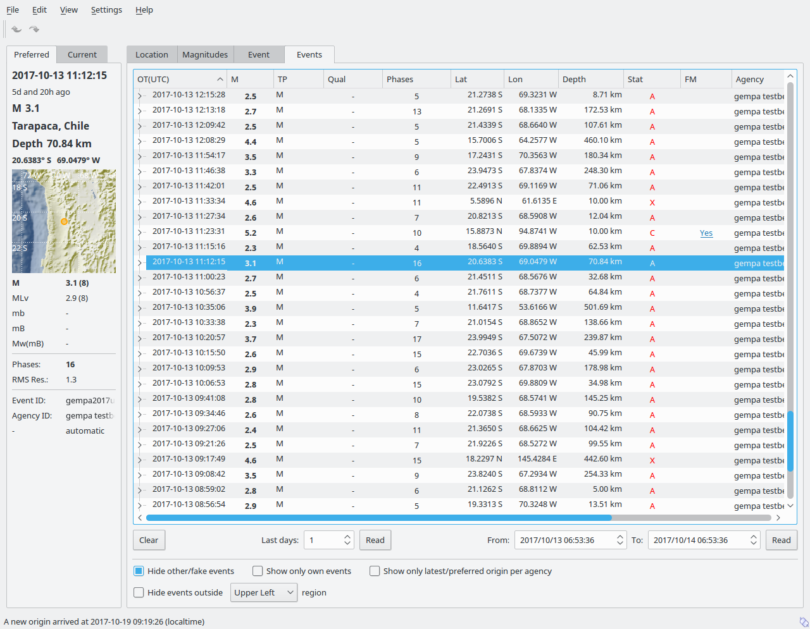

   List of events

The event list contains a checkbox *Hide other/fake events*. If checked all
events with type *not existing* or *other* are hidden. If unchecked they are
shown. It is possible to configure the event types used for this filter as well
as the label text of the checkbox.

.. code-block:: sh

   # Define the event types to be filtered
   eventlist.filter.types.blacklist = "not existing", "other",\
                                      "outside of network interest"

   # Define the label of the button to filter the events
   eventlist.filter.types.label = "Hide fake events"

   # Define the default behaviour
   eventlist.filter.types.enabled = true

Another option to filter events is by agencyID. The button *Show only own events*
will hide all events where the preferred origins agencyID is not the configured
:confval:`agencyID` of scolv. This is the default behaviour which can be customized.

.. code-block:: sh

   # Set the preferred agencyIDs to GFZ and EMSC
   eventlist.filter.agencies.whitelist = GFZ, EMSC

   # Set type to 'origins' which means that an event will pass the filter if
   # at least one origin is from a preferred agency defined with the whitelist
   # above. The default type is 'events' which checks only the events preferred
   # origin.
   eventlist.filter.agencies.type = origins
   eventlist.filter.agencies.label = "Show only my preferred events"

   # Enable this filter initially. If this option is not used the filter
   # is disabled by default.
   eventlist.filter.agencies.enabled = true

As with the arrival table the shown columns of the list are also configurable.
The available identifiers are:

* **OT(GMT)**
* **Type**
* **M**
* **TP**
* **Phases**
* **Lat**
* **Lon**
* **Depth**
* **Stat**
* **Agency**
* **Author**
* **Region**
* **ID**

The bold identifiers are visible initially. This list can also be customized
with

.. code-block:: sh

   # Remove Type and Author from column list that is initially active
   eventlist.visibleColumns = OT(GMT), M, TP, Phases, Lat, Lon,\
                              Depth, Stat, Agency, Region, ID

To show or hide columns interactively click with the right mouse button on the
table header and check or uncheck the corresponding column.

Custom quantities
=================

Since the internal data model is limited, scolv allows addition of custom quantities
derived from the origin objects to the information panel, to the origin list of
Event tab and to the Event list. This can help to evaluate origins in a better
way.

Two source are supported, origin comments and custom scripts.

Origin comments
---------------

Currently only one comment can be added to the different panels.

To add a comment value to the information panel of the Location tab, the
following configuration can be used:

.. code-block:: sh

   # Define the comment id to be used
   display.origin.comment.id = SED.quality

   # Define the default display value if no comment is available
   display.origin.comment.default = "-"

   # Define the label text in the information panel for this value
   display.origin.comment.label = Quality

To add a custom column to the origin list of the Event tab using a comment
value, the following configuration can be used:

.. code-block:: sh

   # Define the default value if no comment is present
   eventedit.customColumn.default = "-"

   # Define the comment id to be used
   eventedit.customColumn.originCommentID = SED.quality

   # Define the column header label
   eventedit.customColumn = "Qual"

   # Define the column position in the table
   eventedit.customColumn.pos = 4

   # Allows to map comment values (strings) to colors. In this case the
   # comment will have A,B,C or D which is mapped to green, yellow, orange and
   # red
   eventedit.customColumn.colors = "A:00FF00","B:rgb(64,192,0)",\
                                   "C:rgb(192,64,0)","D:FF0000"

To add a custom column to the event list of the Events tab using a comment
value, the following configuration can be used:

.. code-block:: sh

   # Define the default value if no comment is present
   eventlist.customColumn.default = "-"

   # Define the comment id to be used
   eventlist.customColumn.originCommentID = "SED.quality"

   # Define the column header label
   eventlist.customColumn = "Qual"

   # Define the column position in the table
   eventlist.customColumn.pos = 5

   # Allows to map comment values (strings) to colors. In this case the
   # comment will have A,B,C or D which is mapped to green, yellow, orange and
   # red
   eventlist.customColumn.colors = "A:00FF00","B:rgb(64,192,0)",\
                                   "C:rgb(192,64,0)","D:FF0000"

The last three examples are used to show the *SED.quality* comment value which
is set by the :ref:`NonLinLoc locator plugin <global_nonlinloc>`.

External scripts
----------------

Another option to add derived origin parameters is to use external scripts.
scolv will call those scripts and writes a binary serialized origin object
to its standard input. scolv reads the script output and displays this value
only if the return code of the script is 0.

An example script which just returns the standard error looks like this:

.. code-block:: python

   #!/usr/bin/env python
   import seiscomp3.DataModel, seiscomp3.IO

   def main():
       ar = seiscomp3.IO.BinaryArchive()

       # Open standard input
       if not ar.open("-"):
           # Hmmm, opening stdin failed
           return 1

       # Read the object
       obj = ar.readObject()
       ar.close()

       # Try to cast obj to an origin
       org = seiscomp3.DataModel.Origin.Cast(obj)

       # No origin -> error
       if not org:
           return 1

       # Try to print the standard error to stdout
       try: print org.quality().standardError()
       # Field not set, return error
       except: return 1

       return 0

    if __name__ == "__main__":
        sys.exit(main())

.. important:: The script must be executable. In Linux don't forget
   to call

   .. code-block:: sh

      chmod +x /path/to/script

As many scripts as necessary to evaluate can be created.

.. warning:: Calling external scripts causes overhead and can take some time
   depending on the implementation of the script. scolv needs to access the
   database to fetch additional information which it does not need normally.
   The slower the database access, the longer it takes to display the results.

To add the output to the information panel of the Location tab, the following
configuration can be used:

.. code-block:: sh

   # Define the available add-ons to be used
   display.origin.addons = qual1, qual2

   # Configure each add-on
   display.origin.addon.qual1.label = "Qual1"
   display.origin.addon.qual1.script = "@CONFIGDIR@/scripts/scolv/qual1"

   display.origin.addon.qual2.label = "Qual2"
   display.origin.addon.qual2.script = "@CONFIGDIR@/scripts/scolv/qual2"

The same can be done for the origin list of the Event tab

.. code-block:: sh

   eventedit.scripts.columns = qual1, qual2
   eventedit.scripts.column.qual1.label = "Qual1"
   eventedit.scripts.column.qual1.pos = 8
   eventedit.scripts.column.qual1.script = "@CONFIGDIR@/scripts/scolv/qual1"
   eventedit.scripts.column.qual2.label = "Qual2"
   eventedit.scripts.column.qual2.pos = 9
   eventedit.scripts.column.qual2.script = "@CONFIGDIR@/scripts/scolv/qual2"

and for the event list of the Events tab

.. code-block:: sh

   eventlist.scripts.columns = qual1, qual2
   eventlist.scripts.column.qual1.label = "Qual1"
   eventlist.scripts.column.qual1.pos = 5
   eventlist.scripts.column.qual1.script = "@CONFIGDIR@/scripts/scolv/qual1"
   eventlist.scripts.column.qual2.label = "Qual2"
   eventlist.scripts.column.qual2.pos = 6
   eventlist.scripts.column.qual2.script = "@CONFIGDIR@/scripts/scolv/qual2"

Adding external scripts to the event list is the most expensive part. Whenever
the event list is reloaded, it will start to run the scripts on all origins
in the background. It can take a while until the complete list has been
processed. A progress indicator is plotted in the middle of the event list while
the background processes are running.

.. _scolv-settings:

Settings
========

All settings of scolv can be adjusted in its configuration file. But to be able
to change some settings on-the-fly, a settings windows is available which can
be opened by pressing :kbd:`F3`.

Global
------

This section contains settings for all the main tabs and *all* waveform windows.

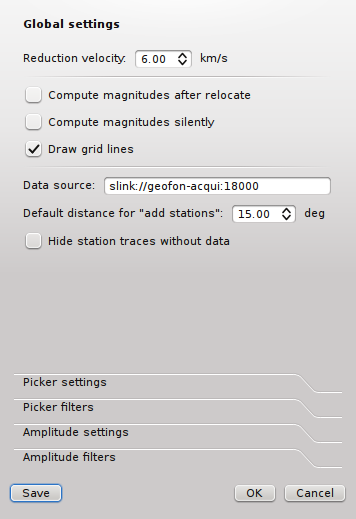

   Global settings

*Reduction velocity*
 Sets the reduction velocity used for plot *MoveOut*.

*Compute magnitudes after relocate*
 Automatically computes magnitudes after each relocation. This has the same
 effect as pressing "Compute magnitudes" manually.

*Compute magnitudes silently*
 Automatically closes the compute magnitudes dialog if the computation is
 finished and no error occurred.

*Draw grid lines*
 Enables dashed grid lines in all plots.

*Data source*
 Defines the waveform data source for both, pick review and amplitude review

*Default distance for "add station"*
 The default value to add stations (traces) that have not been picked or
 associated is 15 degrees. A lower value can be defined, e.g. if mainly local events are analyzed.

*Hide station traces without data*
 If new stations are added during pick review or amplitude review and if no
 data is available for some of those stations, they will be hidden and not
 shown. Once data arrives the trace becomes visible.

Picker
------

This section contains settings for the picker window.

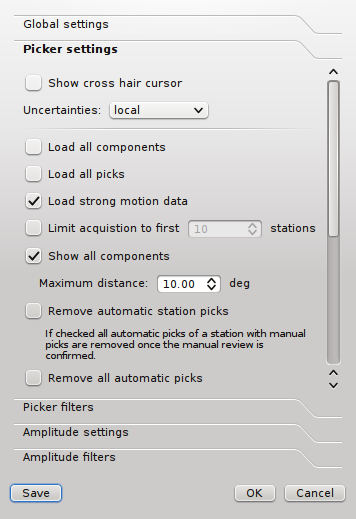

   Waveform picker settings

*Show cross hair cursor*
 Enables the cross hair cursor which shows the currently selected uncertainty
 ranges.

*Uncertainties*
 Select the current uncertainty set to be used (:confval:`picker.uncertainties.preferred`).

*Remove automatic station picks*
 If checked all automatic picks of a station with manual picks are removed once
 the manual review is confirmed.

*Remove all automatic picks*
 If checked all automatic picks are removed once the manual review is confirmed.

Magnitude review
----------------

This section contains settings for the magnitude waveform review window.

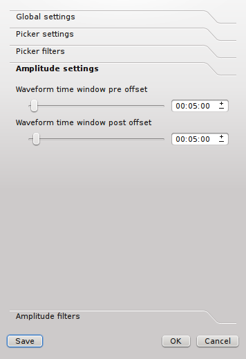

   Amplitude/magnitude review settings

*Waveform time window pre offset*
 Sets an offset before the used amplitude time window that is used when
 collecting data.

*Waveform time window post offset*
 Sets an offset after the used amplitude time window that is used when
 collecting data.

 The greater the offset the more the amplitude time window can be extended or
 shifted.

Hotkeys
=======

The following table described the available key combinations and their triggered
actions in scolv.

+----------------------+-------------------------------------------------------------+
| Shortcut             | Description                                                 |
+======================+=============================================================+
| **Mainwindow**                                                                     |
+----------------------+-------------------------------------------------------------+
| F2                   | Setup connection dialog                                     |
+----------------------+-------------------------------------------------------------+
| F3                   | Picker settings dialog                                      |
+----------------------+-------------------------------------------------------------+
| F8                   | Display left event summary panel                            |
+----------------------+-------------------------------------------------------------+
| F9                   | Show ray paths and associated stations                      |
+----------------------+-------------------------------------------------------------+
| F10                  | Show event list                                             |
+----------------------+-------------------------------------------------------------+
| F11                  | Toggle fullscreen                                           |
+----------------------+-------------------------------------------------------------+
| Ctrl+N               | Create an unassociated artificial origin at the current map |
|                      | center                                                      |
+----------------------+-------------------------------------------------------------+
| Ctrl+Z               | Go back to last origin (if available)                       |
+----------------------+-------------------------------------------------------------+
| Ctrl+Shift+Z         | Go to next origin (if available)                            |
+----------------------+-------------------------------------------------------------+
| Ctrl+PgUp            | Load previous event from the event list                     |
+----------------------+-------------------------------------------------------------+
| Ctrl+PgDown          | Load next event from the event list                         |
+----------------------+-------------------------------------------------------------+
| Mouse wheel          | Zoom map in/out                                             |
+----------------------+-------------------------------------------------------------+
| Double click         | Center map at the clicked position                          |
+----------------------+-------------------------------------------------------------+
| **Picker**                                                                         |
+----------------------+-------------------------------------------------------------+
| 1 .. 9               | Activate configured phase picking                           |
+----------------------+-------------------------------------------------------------+
| Space                | If phase picking is enabled, set pick                       |
+----------------------+-------------------------------------------------------------+
| Esc                  | Leaving picking mode                                        |
+----------------------+-------------------------------------------------------------+
| F3                   | Add station                                                 |
+----------------------+-------------------------------------------------------------+
| F5                   | Relocate                                                    |
+----------------------+-------------------------------------------------------------+
| Y                    | Decrease row height of trace list                           |
+----------------------+-------------------------------------------------------------+
| Shift+Y              | Increase row height of trace list                           |
+----------------------+-------------------------------------------------------------+
| S                    | Maximize visible amplitudes                                 |
+----------------------+-------------------------------------------------------------+
| Shift+S              | Toggle spectrogram of selected trace                        |
+----------------------+-------------------------------------------------------------+
| Ctrl+S               | Show Fourier spectrum of selected trace                     |
+----------------------+-------------------------------------------------------------+
| F                    | Toggle filter                                               |
+----------------------+-------------------------------------------------------------+
| Shift+F              | Toggle filter but limits to the selected trace              |
+----------------------+-------------------------------------------------------------+
| Ctrl+F               | Show spectrum of current trace                              |
+----------------------+-------------------------------------------------------------+
| Z                    | Switch to Z-component                                       |
+----------------------+-------------------------------------------------------------+
| N                    | Switch to N-component                                       |
+----------------------+-------------------------------------------------------------+
| E                    | Switch to E-component                                       |
+----------------------+-------------------------------------------------------------+
| >                    | Increase time scale in trace overview                       |
+----------------------+-------------------------------------------------------------+
| <                    | Decrease time scale in trace overview                       |
+----------------------+-------------------------------------------------------------+
| Ctrl+N               | Default trace view                                          |
+----------------------+-------------------------------------------------------------+
| Ctrl+T               | Toggle display of theoretical arrivals                      |
+----------------------+-------------------------------------------------------------+
| Ctrl+P               | Toggle display of picks (not arrivals). If picks should     |
|                      | be shown for the first, all picks within the time span of   |
|                      | interest are loaded from database. The behaviour is the     |
|                      | same as ticking the option "Load all picks".                |
+----------------------+-------------------------------------------------------------+
| Ctrl+Up              | Amplitude zoom in                                           |
+----------------------+-------------------------------------------------------------+
| Ctrl+Down            | Amplitude zoom out                                          |
+----------------------+-------------------------------------------------------------+
| Ctrl+Right           | Time zoom in                                                |
+----------------------+-------------------------------------------------------------+
| Ctrl+Left            | Time zoom out                                               |
+----------------------+-------------------------------------------------------------+
| Ctrl+0               | Align by origin time                                        |
+----------------------+-------------------------------------------------------------+
| Ctrl+F1              | Align on P arrival                                          |
+----------------------+-------------------------------------------------------------+
| Ctrl+F2              | Align on S arrival                                          |
+----------------------+-------------------------------------------------------------+
| Ctrl+[1..9]          | Align on 1st-9th favourite phase                            |
+----------------------+-------------------------------------------------------------+
| Ctrl+Shift+[1..9]    | Align on theoretical arrival of 1st-9th favourite phase     |
+----------------------+-------------------------------------------------------------+
| Ctrl+WheelUp         | Amplitude zoom in                                           |
+----------------------+-------------------------------------------------------------+
| Ctrl+WheelDown       | Amplitude zoom out                                          |
+----------------------+-------------------------------------------------------------+
| Shift+WheelUp        | Time zoom in                                                |
+----------------------+-------------------------------------------------------------+
| Shift+WheelDown      | Time zoom out                                               |
+----------------------+-------------------------------------------------------------+
| Ctrl+Shift+WheelUp   | Time and amplitude zoom in                                  |
+----------------------+-------------------------------------------------------------+
| Ctrl+Shift+WheelDown | Time and amplitude zoom out                                 |
+----------------------+-------------------------------------------------------------+
| Left                 | Move trace view to left (fine)                              |
+----------------------+-------------------------------------------------------------+
| Right                | Move trace view to right (fine)                             |
+----------------------+-------------------------------------------------------------+
| Shift+Left           | Move trace view to left (rough)                             |
+----------------------+-------------------------------------------------------------+
| Shift+Right          | Move trace view to left (rough)                             |
+----------------------+-------------------------------------------------------------+
| Up                   | Scroll up (through the traces)                              |
+----------------------+-------------------------------------------------------------+
| Down                 | Scroll down (through the traces)                            |
+----------------------+-------------------------------------------------------------+
| Alt+Right            | Jump to next marker (picking mode)                          |
+----------------------+-------------------------------------------------------------+
| Alt+Left             | Jump to previous marker (picking mode)                      |
+----------------------+-------------------------------------------------------------+
| Alt+D                | Sort by distance                                            |
+----------------------+-------------------------------------------------------------+
| Alt+R                | Sort by residual                                            |
+----------------------+-------------------------------------------------------------+
| T                    | Temporarily toggle 3 component view in picking trace        |
+----------------------+-------------------------------------------------------------+
| W                    | Reset scale in picking trace                                |
+----------------------+-------------------------------------------------------------+
