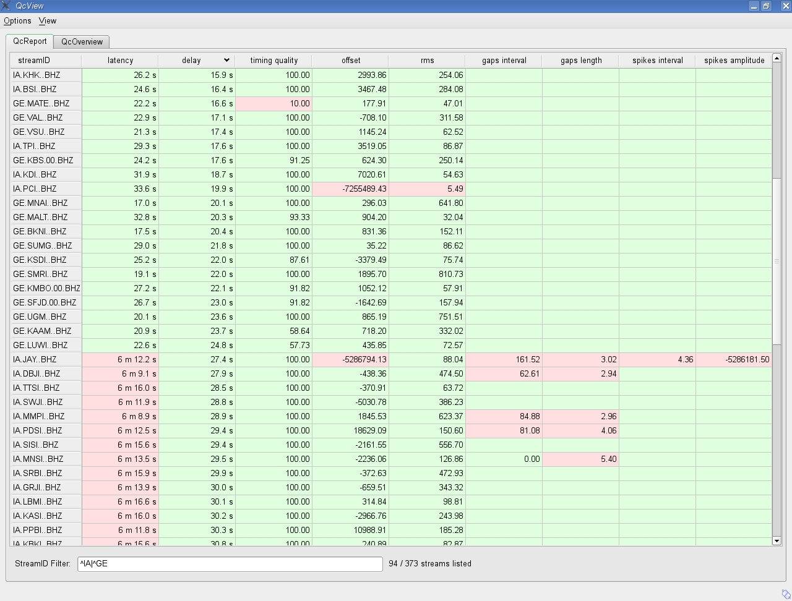
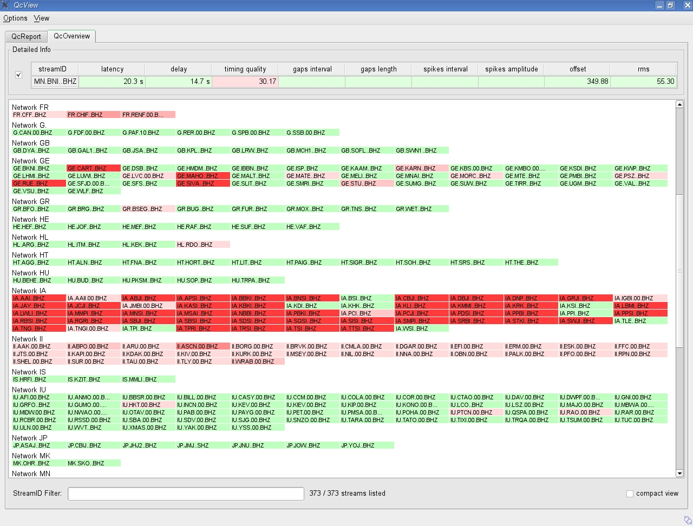
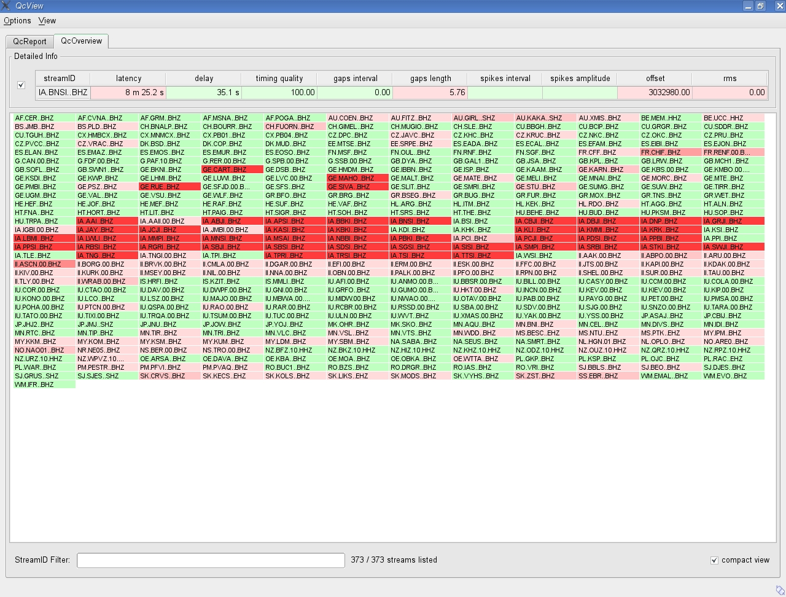

scqcv provides both, a brief overview of the seismometer network status and a
detailed view of specific stream parameters. Quality Control (QC) parameters,
determined by scqc and sent via messaging system, are received and displayed.
:ref:`fig-tab-view` shows the tabular view of the QC report messages.
Each QC parameter is shown in a column. The default sorting by stream code can
be changed by pressing a header field of a parameter. A widget displaying the
currently received waveform data is shown by pressing the cell with the stream
information. Positioning the mouse over the parameter cell a ToolTip indicates
more detailed information for the selected parameter. Typing a regular
expression in the "StreamIDFilter" text entry field will result in a stream code
filter, only displaying the matching stream codes with qc parameter. Green
colored fields indicate that the QC parameter values lie within the configured
"good" interval. Red colors indicate that the QC parameters lie outside the
tolerated value interval -- this stream might have an issue.

.. _fig-tab-view:

   Tabulator view of scqcv

:ref:`fig-status-overview` shows the status overview grouped by network code.
The more the color varies to dark red, the worse the waveform data might be.
A dark red color indicates a stream with high latency. Light to darker red
represents a badness sum of related QC parameters. Colors are subject to be
changed in near future. Pressing a stream code item opens a single line table
with detailed information of the selected stream. Again it is possible to open
a real time waveform widget by pressing the leading header field indicating
the stream code. Typing a regular expression in the bottom text entry field
will result in a stream code filter, only displaying the matching stream codes.

.. _fig-status-overview:

   Status overview of scqcv

The compact status overview allows a quick impression of the present status of
all received streams (:ref:`fig-compact-status`). Functionality is equal to the
status overview grouped by network. You can switch between compact view and
network seperated view by clicking the checkbox in the bottom line.

.. _fig-compact-status:

   Compact status overview of scqcv

Example configuration
=====================

.. code-block:: sh

   connection.subscription = QC
   plugins = qcplugin_delay, qcplugin_latency, qcplugin_timing, \
             qcplugin_rms, qcplugin_offset, qcplugin_gap, \
             qcplugin_spike
   plugins.default.expire = 0
   plugins.default.goodInterval = 0.0, 99E99
   plugins.default.useAbs4good = 0
   plugins.qcplugin_spike.expire = 600
   plugins.qcplugin_spike.goodInterval = 0.0, 0.0
   plugins.qcplugin_gap.expire = 600
   plugins.qcplugin_gap.goodInterval = 0.0, 0.0
   plugins.qcplugin_offset.useAbs4good = 1
   plugins.qcplugin_offset.goodInterval = 0.0, 550E3
   plugins.qcplugin_delay.goodInterval = 0.0, 60.0
   plugins.qcplugin_latency.goodInterval = 0.0, 300.0
   plugins.qcplugin_timing.goodInterval = 50, 100
   plugins.qcplugin_rms.goodInterval = 10.0, 10E6
