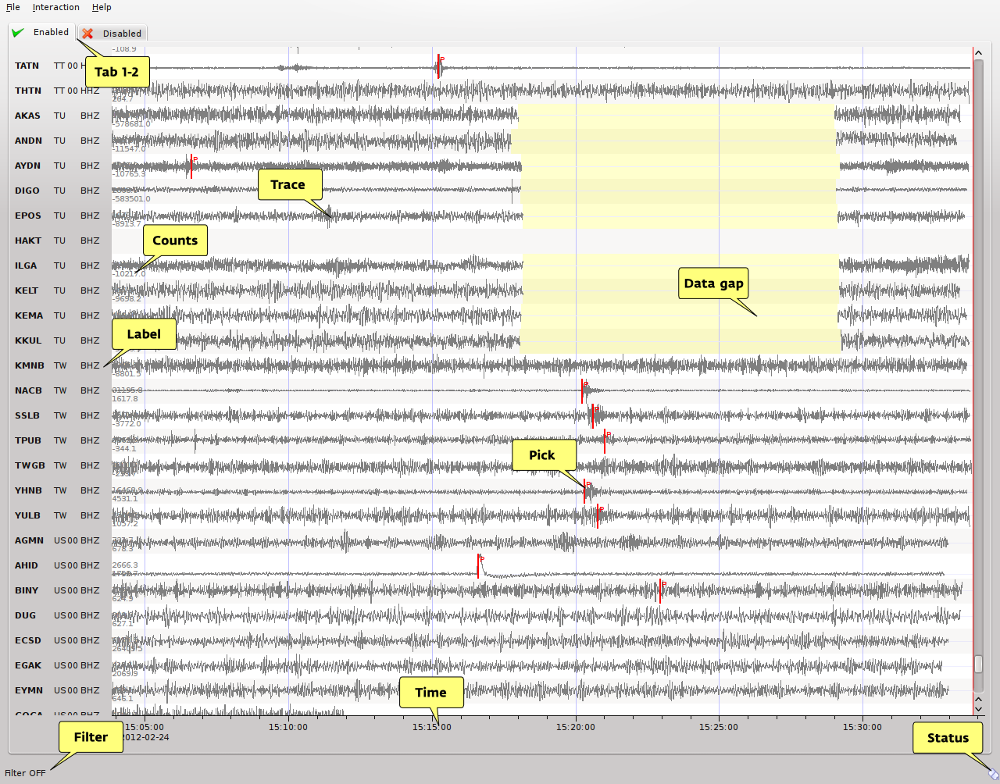
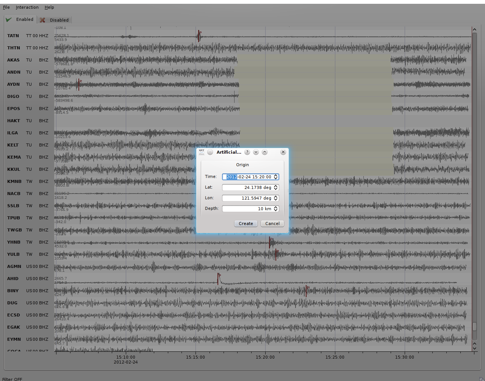

scrttv visualizes real-time waveform data (see :ref:`fig-scrttv-overview`) of
a defined window length (default=30 minutes) and of defined streams/stations
(default is primary station channels). scrttv switches between two modi.
In the normal mode the trace order is given by the configuration file.
In the event mode the traces are sorted by epicentral distance to the
latest origin received from the messaging. Additional to the waveform
traces information about gaps, picks and the time of incoming origins
are displayed.

.. _fig-scrttv-overview:

   scrttv overview

   An example of scrttv and the dialog window to set preliminary origin.
   Tab 1-2 = enable/disable tab; Counts = maximum counts of a stream;
   Info = stream information (station, network and channel code);
   Filter = filter status of the traces; Status = connection status.

scrttv shows two tabs: the enabled and the disabled tab (see :ref:`fig-scrttv-overview`: Tab 1-2).
Stations listed in the disabled tab are excluded from processing (e.g. picking). To move a station
from one tab to another just drag and drop the trace to the new tab. An alternative solution is
to double click on the trace label to disable a trace.

Normally, the raw data are displayed. Pressing :kbd:`f` the predefined bandpass filter
of third order from 0.5 Hz to 10 Hz, :py:func:`BW<BW>`\ (3,0.5,10) is applied to the traces.
Also zoom functions for the time and amplitude axis are provided.

   artifical origin

In case the operator recognizes several seismic signals, an artificial/preliminary origin can be set
by either pressing the middle mouse button on a trace or by opening the context menu (right mouse button)
on a trace and selecting "Create artificial origin". The following pop-up window show the coordinates of the
trace and the time the click was made on the trace. Pressing "Send" sends this origin to the
LOCATION group. This artificial origin is received e.g. by :ref:`scolv` and enables an immediate
manual analysis of the closest traces.

Hotkeys
=======

=====================  =======================================
Hotkey                 Description
=====================  =======================================
:kbd:`F2`              Setup connection dialog
:kbd:`F11`             Toggle fullscreen
:kbd:`f`               Toggle filter
:kbd:`r`               Toggle all records
:kbd:`z`               Toggle zoom
:kbd:`up`              Line up
:kbd:`down`            Line down
:kbd:`PgUp`            Page up
:kbd:`PgDn`            Page down
:kbd:`Alt+PgUp`        To top
:kbd:`Alt+PgDn`        To bottom
:kbd:`left`            Scroll left
:kbd:`right`           Scroll right
:kbd:`Ctrl+left`       Align left
:kbd:`Ctrl+right`      Align right
:kbd:`Alt+q`           Quit
:kbd:`1`               Restore configuration order of traces
:kbd:`2`               Sort traces by distance
:kbd:`3`               Sort traces by station code
:kbd:`4`               Sort traces by network-station code
:kbd:`<`               Horizontal zoom-in
:kbd:`>`               Horizontal zoom-out
:kbd:`y`               Vertical zoom-out
:kbd:`Shift+y`         Vertical zoom-in
:kbd:`n`               Set default display
=====================  =======================================