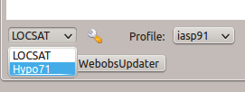
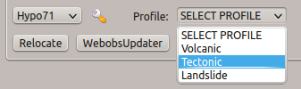
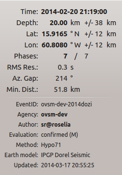
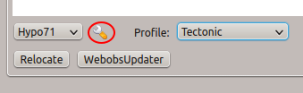
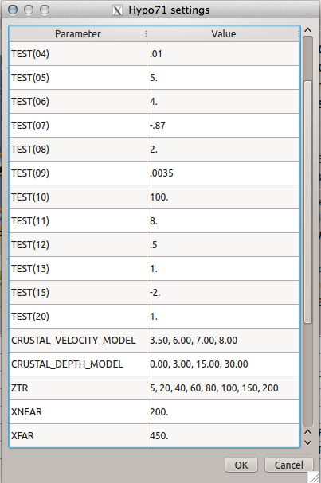

Co-financed by `the European Union and le Ministère de l'Ecologie, 
du Développement Durable, des Transports et du Logement
<http://www.developpement-durable.gouv.fr/>`_ (http://tsuareg.ipgp.fr, http://www.interreg-caraibes.org),
developed by `OVSM (IPGP) <http://www.ipgp.fr>`_.

The `Hypo71 <http://jclahr.com/science/software/hypo71/>`_ locator algorithm has
been implemented into SeisComP3 through the plugin mechanism. A new plugin hypo71
contains the LocatorInterface implementation for Hypo71.

This plugin uses a slightly modified Hypo71 version from Alexandre Nercessian (IPGP)
which allows negative earthquake depth (above sea level) and negative stations
altitude (below sea level - OBS).

How it works
============

When receiving a list of arrivals to locate, the plugin builds a Hypo71 input
file with informations from the station inventory and configured profile.
It then runs Hypo71, reads the output file and sends the results (location,
uncertainties, RMS, pick residuals ...) to SeisComP3.

If several trial depths are configured, the plugin will run as many Hypo71
rushes as configured depths.
Then all the results are read, and a decision is made on the best one, based on
location RMS and uncertainty.
A final run is then made with the best result depth as trial depth.

Profiles
========

The plugin allows the user to set up as many profiles as needed.
A profile contains all the information relative to the velocity model and
Hypo71 iteration parameters.

This allows the user to tune the behaviour of Hypo71 to what he needs.
If no profiles are set-up, the plugin will use default Hypo71 profile, according
to example shown in Hypo71 first publication.
Some of this default Hypo71 parameters have been altered to allow more and finer
iteration, since computer power is now far above what was available in the 1970's.

Error measures
==============

After running Hypo71, the output is converted into a SC3 (SC3ML) origin
object including some error measures. The following table shows how
the Hypo71 error measures are mapped to the SC3 data model:

=========================================================  =====================================================
SC3                                                        Hypo71
=========================================================  =====================================================
Origin.latitude.uncertainty                                ERH/sqrt(2)
Origin.longitude.uncertainty                               ERH/sqrt(2)
Origin.depth.uncertainty                                   ERZ
Origin.originQuality.standardError                         _
Origin.originQuality.secondaryAzimuthalGap                 _
Origin.originQuality.usedStationCount                      usedStationCount
Origin.originQuality.associatedStationCount                associatedStationCount
Origin.originQuality.associatedPhaseCount                  associatedPhaseCount
Origin.originQuality.usedPhaseCount                        associatedPhaseCount
Origin.originQuality.depthPhaseCount                       depthPhaseCount
Origin.originQuality.minimumDistance                       km2deg(Tdist.front)
Origin.originQuality.maximumDistance                       km2deg(Tdist.back)
Origin.originQuality.medianDistance                        km2deg(~Tdist)
Origin.originQuality.groundTruthLevel                      QUALITY
Origin.originUncertainty.horizontalUncertainty             _
Origin.originUncertainty.minHorizontalUncertainty          _
Origin.originUncertainty.maxHorizontalUncertainty          _
Origin.originUncertainty.azimuthMaxHorizontalUncertainty   _
ConfidenceEllipsoid.semiMajorAxisLength                    _
ConfidenceEllipsoid.semiMinorAxisLength                    _
ConfidenceEllipsoid.semiIntermediateAxisLength             _
ConfidenceEllipsoid.majorAxisPlunge                        _
ConfidenceEllipsoid.majorAxisAzimuth                       _
ConfidenceEllipsoid.majorAxisRotation                      _
=========================================================  =====================================================

Plugin
======

The Hypo71 plugin is installed under :file:`share/plugins/hypo71.so`.
It provides a new implementation of the LocatorInterface with the name Hypo71.

To add the plugin to a module add it to the modules configuration, either
:file:`modulename.cfg` or :file:`global.cfg`:

.. code-block:: sh

   plugins = ${plugins}, hypo71

Basically it can be used by two modules: :ref:`screloc` and :ref:`scolv`.

Output
======

All output is stored in the configured :confval:`HYPO71ROOT`.

The following file are stored:

- Input file (input)
- Input configuration (.INP)
- Hypo71 location header (.OUT)
- Hypo71 location results (.PRT)
- Hypo71 ZTR evalutation log (.LOG)

In addition to the native Hypo71 output a SC3 origin object is created and
returned to the calling instance. Usually this object is then sent via messaging.

Configuration example
=====================

To add the plugin to an application such as scolv or screloc, add the plugin
name to the list of plugins that are loaded (e.g. :file:`scolv.cfg`):

.. code-block:: sh

   plugins = ${plugins}, hypo71

Futhermore add the plugin configuration:

.. code-block:: sh

   ########################################################
   ############# Hypo71 plugin configuration ##############
   ########################################################
   
   # Hypo71 input file to process (generated by plugin)
   hypo71.inputFile = @DATADIR@/hypo71/HYPO71.INP
   
   # Hypo71 log file to store ZTR calculation and final results
   hypo71.logFile = @DATADIR@/hypo71/HYPO71.LOG
   
   # Hypo71 output file to read results from (generated by binary)
   hypo71.outputFile = @DATADIR@/hypo71/HYPO71.PRT
   
   # Hypo71 script called by plugin
   hypo71.hypo71ScriptFile = @DATADIR@/hypo71/run.sh
   
   # Hypo71 default profile
   hypo71.defaultControlFile = @DATADIR@/hypo71/profiles/default.hypo71.conf
   
   # Hypo71 origin patternID
   hypo71.publicID = Hypo71.@time/%Y%m%d%H%M%S.%f@.@id@
   
   # Should we use the custom patternID ?
   hypo71.useHypo71PatternID = false
   
   # Hypo71 custom profiles examples
   hypo71.profiles = ModelA
   hypo71.profile.ModelA.earthModelID = "My Velocity Model A"
   hypo71.profile.ModelA.methodID = Hypo71PC
   hypo71.profile.ModelA.controlFile = @DATADIR@/hypo71/profiles/profile.a.conf

Verify that everything is properly set up in the script `@DATADIR@/hypo71/run.sh`

.. code-block:: sh

   #!/bin/bash
   HYPO71PC_BINARY=Hypo71PC
   HYPO71PC_HOME=`dirname $0`

   # Jumping into the right directory
   cd ${HYPO71PC_HOME}/

   # Executing binary with input file as argument
   ./$HYPO71PC_BINARY < input

Add a symlink from the Hypo71PC binary to the hypo71 working directory :

.. code-block:: sh

   ln -s ${HOME}/seiscomp3/bin/Hypo71PC ${HOME}/seiscomp3/share/hypo71/Hypo71PC

Verify that everything is properly set up in the file `${HOME}/seiscomp3/share/hypo71/input`

.. code-block:: sh

   HYPO71.INP
   HYPO71.PRT
   HYPO71.OUT

Notice the 3 blank lines at the end of "input" file, those are not to be removed.

Finally set-up your Hypo71 profile (${HOME}/seiscomp3/share/hypo71/profiles/profile.a.conf

.. code-block:: sh

   ############################################################
   ##             HYPO71 SeisComP3 Plugin                    ##
   ##                                          @OVSM-IPGP    ##
   ##                                                        ##
   ############################################################

   ## This profile is based on Dorel velocity model for French Antilles
   ## It allows several iterations at different starting depth for deep and crustal earthquakes

   ##############
   # Reset List #
   ##############
   TEST(01) = .1    # sec # cutoff RMS value under which Jeffrey's weghting of residuals is not used
   TEST(02) = 50.   # km  # 
   TEST(03) = 0.2    # critical F-value for the stepwise multiple regression
   TEST(04) = .01   # km # adjustment value under which Geiger's iteration is terminated
   TEST(05) = 5.    # km # focal-depth value above which DZ is rest to DZ / (K+1)
   TEST(06) = 4.    # regression TEST(03)/TEST(06) coefficient value if no significant variable is found in the stepwise multiple regression
   TEST(10) = 2.  # km # coefficient value J = D/TEST(10) used for resetting DX and DY
   TEST(11) = 999.    # maximum number of iterations in the hypocentral adjustment
   TEST(12) = .5    # coefficient value DZ = -Z*TEST(12) used for resetting DZ when hypocenter is placed in the air
   TEST(13) = 1.    # km # standard error value of hypocentral optionally calculated RMS
   
   ## The following values are only available with the Hypo71PC version modified by Alexandre Nercessian (IPGP) which is included with this plugin
   TEST(15) = -2.   # km # maximum altitude of earthquake in km (down is positive)
   TEST(20) = 1.    # used altitude = read altitude * TEST(20) - for example, -2500 = -250 * 10
   
   
   ######################
   # Crustal Model List #
   ######################
   CRUSTAL_VELOCITY_MODEL = 3.50, 6.00, 7.00, 8.00
   CRUSTAL_DEPTH_MODEL = 0.00, 3.00, 15.00, 30.00
   
   
   ################
   # Control Card #
   ################
   # MANDATORY
   ZTR = 5, 20, 40, 60, 80, 100, 150, 200   # km # trial focus depth, at least two
   # MANDATORY
   XNEAR = 200. # km # distance from epicenter up to which the distance weighting is 1
   # MANDATORY
   XFAR = 450. # km # distance from epicenter beyond which the distance weighting is 0
   # MANDATORY
   POS = 1.76  # ratio of P-velocity to S-velocity

   KAZ = 1      # 1 or blank # apply azimuthal weighting of stations ?
   KSORT = 1    # 1 or blank # sort stations by distance in the output ?
   
   # Use the position obtained from the best ZTR value ?
   USE_TRIAL_POSITION = false
   
   
   ####################
   # Instruction Card #
   ####################
   KNST = 1 # use S data ?
   INST = 0 # fix depth ?

   #####################################
   # Optionnal Weighting Look-Up Table #
   #####################################
   # Uncomment if you want to disable dynamic weighting and use those uncertainties as
   # boundaries for weighting (e.g. a pick with +-0.02 will have a weight of 0)
   #WEIGHT_UNCERTAINTY_BOUNDARIES = 0.1, 0.2, 0.5, 1.0

Usage
=====

Locator
-------

The usage of the new Hypo71 plugin is straight forward. Once loaded successfully
the new locator shows up in the lower left corners combo box.

Select the new Hypo71 locator and a profile from the pre-configured list.

The Hypo71 implementation doesn't provide a virtual profile automatic but the
plugins ships with some example profiles.

If an origin has been relocated the method should be set to "Hypo71" and
the earth model contains the name of the profile used to perform this localization.

Settings
--------

The Hypo71 locator implementation supports to override configured settings or
control parameters for a session. Those changes are not persistent and lost if
the locator is changed to another one or the profile has been changed.

To open the settings dialog press the button right to the locator selection
combo box.

Then the Hypo71 selected profile parameters show up.

More
====

Take a look at `Fred Klein HYPOINVERSE Earthquake Location` software
`<http://earthquake.usgs.gov/research/software/#HYPOINVERSE>`_

Hypo71PC original manual and binary are available on JC Lahr website.
`<http://jclahr.com/science/software/hypo71/>`_
