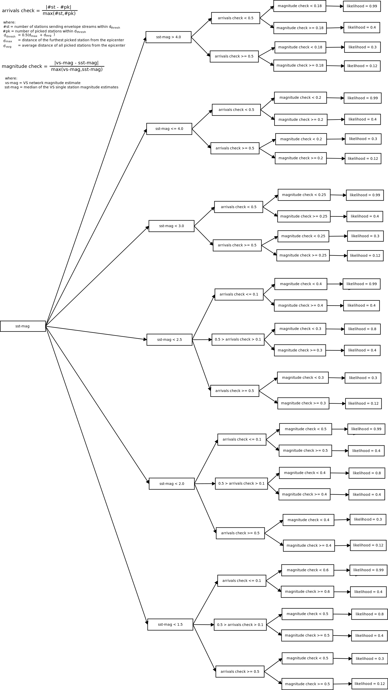

The Virtual Seismologist in SeisComP3 (VS(SC3)) provides near instantaneous
estimates of earthquake magnitude as soon as SeisComp3 origins are available. With a
well-configured SeisComP3 system running on a dense network, magnitudes for
local events can be available within 10-20 s of origin time. VS(SC3) can be a key
component of an earthquake early warning system, and can be used to provide
rapid earthquake notifications. With the capability to estimate magnitude
(given a location estimate) with 3-seconds of P-wave information at a single
station, VS(SC3) magnitude estimates are tens of seconds faster than
conventional Ml calculations, which require waiting for the peak S-wave
amplitudes. The VS magnitude estimation relationships consist of 1) a
relationship between observed ground motion ratios (between vertical
acceleration and vertical displacement) and magnitude, and 2) envelope
attenuation relationships describing how various channels of envelope
amplitudes vary as a function of magnitude and distance. These relationships
were derived from a Southern California dataset with events in the magnitude
range 2.5 <= M <= 7.6 and the Next Generation Attenuation (NGA) strong motion
dataset. Once a SeisComp3 location estimate is available, VS magnitude estimates
can be computed with as little as 3 seconds of envelope data at a single
station (i.e., 3 seconds after trigger time at a single station). Typically,
usable envelope data is available at numerous stations by the time the first
SeisComp3 origin is available. The VS magnitude estimates are then updated every
second for 30 seconds (configurable). The SeisComp3 implementation allows for use of
broadband high-gain seismometers (with clipping value selected) as well as
strong motion data. For co-located stations, VS magnitudes are calculated using
the strong motion channels if the broadband channels saturate.
VS magnitudes in SeisComp3 are called MVS.

Development
-----------

The Virtual Seismologist method is a Bayesian approach to earthquake early
warning (EEW) that estimates earthquake magnitude, location, and the
distribution of peak ground shaking using observed picks and ground motion
amplitudes, predefined prior information, and envelope attenuation
relationships (Cua, 2005; Cua and Heaton, 2007; Cua et al., 2009). The
application of Bayes' theorem in EEW (Cua, 2005) states that the most probable
source estimate at any given time is a combination of contributions from prior
information (candidate priors include network topology or station health status,
regional hazard maps, earthquake forecasts, and the Gutenberg-Richter
magnitude-frequency relationship) and constraints from the available
real-time ground motion and arrival observations. VS is envisioned as an
intelligent, automated system capable of mimicking how human seismologists can
make quick, relatively accurate “back-of-the-envelope” interpretations of
real-time (and at times, incomplete) earthquake information, using a mix of
experience, background information, and real-time data. The formulation of the
VS Bayesian methodology, including the development of the underlying
relationships describing the dependence of various channels of ground motion
envelopes on magnitude and distance, and how these pieces come together in EEW
source estimation, was the result of the PhD research of Dr. Georgia Cua with
Prof. Thomas Heaton at Caltech, from 1998 through 2004.

The first real-time VS prototype system was developed by Georgia Cua and Michael
Fischer at ETH Zurich from 2006-2012 (http://www.seismo.ethz.ch/research/vs). 
This first prototype used location estimates generated
by the Earthworm Binder module (Dietz, 2002) as inputs to the VS magnitude
estimation. This architecture has been undergoing continuous real-time testing
in California (since 2008) and Switzerland (since 2010). In California, VS is
one of the three EEW algorithms that make up the CISN ShakeAlert EEW system
(http://www.cisn.org/eew/). The other algorithms are the ElarmS algorithm from
UC Berkeley and the TauC/Pd OnSite algorithm from Caltech.
In 2012/13, with funding from the EU projects NERA ("Network of European
Research Infrastructures for Earthquake Risk Assessment and Mitigation") and
REAKT ("Strategies and Tools for Real-Time EArthquake RisK ReducTion"), VS was
integrated into SeisComP3 by the Seismic Network group at the SED in ETH
Zurich and gempa GmbH. Both real-time VS implementations (Binder- and SeisComp3-based)
focus on real-time processing of available pick and envelope data. Prior
information is not included.

VS and SeisComP3
----------------

Although the codes were effectively re-written, the basic architecture used in
the original Earthworm-based implementation is used in SeisComp3. The SeisComp3 modules
scautopick, scautoloc, and scevent replace the Earthworm Binder module for
providing location estimates. Two new VS-specific modules were developed to
continuously calculate envelope amplitudes and to calculate and update VS
magnitudes (MVS) once a SeisComP3 origin is available.

- :ref:`scenvelope`
- :ref:`scvsmag`

MVS is calculated and updated (with updates attached to the preferred origin)
each second for 30 seconds (unless configured differently) after it is first
invoked by the availability of a new SeisComp3 event. If configured, Ml can also be
calculated for these events.

An additional module, :ref:`scvsmaglog`, creates log output and mails solutions
once a new event is fully processed. It also provides an interface to send 
alerts in real-time.

Configuring and optimizing VS(S3) for EEW
----------------------------------------------

The performance of VS(SC3) is strongly dependent on: 1) the quality and
density of the seismic network; 2) the configuration of the general SeisComp3 system.
scautoloc requires at least 6 triggers to create an origin. Given the network
geometry, maps of when VS estimates would be first available
(indicative of the size of the blind zone as a function of earthquake location
relative to stations) can be generated for regions where EEW is of interest. VS(SC3)
uses scautoloc, which was not built for EEW, so an
additional delay of at most a few seconds is required for origin processing. VS
magnitudes (MVS) can be expected within 1-2 seconds after a SeisComp3 origin is
available. In the densest part of the Swiss network, SeisComp3 origins are available
within 10-15 seconds after origin time; MVS is typically available 1-2 seconds
later.

The VS magnitude estimation relationships in Cua (2005) were derived from a
dataset consisting of Southern California waveforms and the NGA strong motion
dataset. In theory, customizing VS to a specific region requires deriving a set
of envelope attenuation relationships (168 coefficients) and relationships
between ground motion ratios and magnitude (6 coefficients) from a regional
dataset. In practice, the VS magnitude estimation relationships derived from
Southern California have been shown to work reasonably well in Northern
California and Switzerland (Behr et al, 2012). The envelope and ground motion
ratio coefficients from Cua (2005) are hard-coded in scvsmag, and should not be
modified without full understanding of the VS methodology and potential
consequences of the modifications.

Although scautoloc can produce origins at any depth, the VS magnitude estimation
relationships assume a depth of 3 km. For this reason, it is expected that MVS
will systematically underestimate magnitudes for deep earthquakes. It may be
most practical to simply add empirically derived offsets to MVS for deeper
events, or for particular regions.

Understanding VS output
-----------------------

The VS system currently being offered is a test version. A tool for
dissemination of results is not part of the core modules.

False alarms, missed events, solution quality
---------------------------------------------

The rate of false alarms and missed events is determined by the output of the
normal SeisComp3 origin chain (scautopick, scautoloc), and will be similar to the
performance of the automatic setup for typical network operations (i.e. if you
do not trust your automatic origins for the network, you will not trust them for
VS either). A solution quality is independently estimated by VS, combining
information on location quality and station quality.

.. _fig-VS-likelihood:

   Detailed graph on how the solution quality is determined.

VS License
----------

The SeisComp3 VS modules are free and open source, and are part of the SeisComp3
distribution from Seattle v2013.200. They are distributed under the `'SED Public
License for SeisComP3 Contributions' <see http://www.seismo.ethz.ch/static/seiscomp_contrib/license.txt>`_.

References
----------

Dietz, L., 2002: Notes on configuring BINDER_EW: Earthworm's phase associator, http://folkworm.ceri.memphis.edu/ew-doc/ovr/binder_setup.html (last accessed June 2013)

Cua, G., 2005: Creating the Virtual Seismologist: developments in ground motion characterization and seismic early warning. PhD thesis, California Institute of Technology, Pasadena, California.

Cua, G., and T. Heaton, 2007: The Virtual Seismologist (VS) method: a Bayesian approach to earthquake early warning, in Seismic early warning, editors: P. Gasparini, G. Manfredi, J. Zschau, Springer Heidelberg, 85-132.

Cua, G., M. Fischer, T. Heaton, S. Wiemer, 2009: Real-time performance of the Virtual Seismologist earthquake early warning algorithm in southern California, Seismological Research Letters, September/October 2009; 80: 740 - 747.

Behr, Y., Cua, G., Clinton, J., Heaton, T., 2012: Evaluation of Real-Time Performance of the Virtual Seismologist Earthquake
Early Warning Algorithm in Switzerland and California. Abstract 1481084 presented at 2012 Fall Meeting, AGU, San Francisco, Calif., 3-7 Dec.
