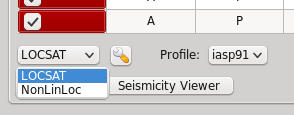
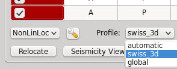
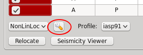
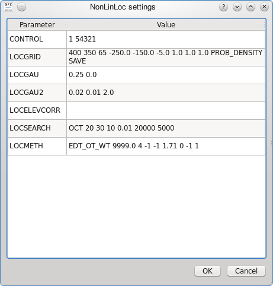

Funded by `SED/ETH Zurich <http://www.seismo.ethz.ch/>`_, developed by `gempa GmbH <http://www.gempa.de>`_.
This plugin is available from SeisComP3 version Release Potsdam 2010 and later.

The `NonLinLoc (NLL) <http://alomax.free.fr/nlloc>`_ locator algorithm has been
implemented into SeisComP3 through the plugin mechanism. A new plugin locnll
contains the LocatorInterface implementation for NonLinLoc.

The implementation bundles the NonLinLoc source files required to use the library
function calls. The following source files are included:

.. code-block:: sh

   GridLib.c
   GridLib.h
   GridMemLib.c
   GridMemLib.h
   NLLocLib.h
   NLLoc1.c
   NLLocLib.c
   calc_crust_corr.c
   calc_crust_corr.h
   crust_corr_model.h
   crust_type_key.h
   crust_type.h
   loclist.c
   octtree.h
   octtree.c
   phaseloclist.h
   phaselist.c
   geo.c
   geo.h
   geometry.h
   map_project.c
   map_project.h
   otime_limit.c
   otime_limit.h
   ran1.c
   ran1.h
   velmod.c
   velmod.h
   util.h
   util.c
   alomax_matrix/alomax_matrix.c
   alomax_matrix/alomax_matrix.h
   alomax_matrix/alomax_matrix_svd.c
   alomax_matrix/alomax_matrix_svd.h

Error measures
==============

After running NonLinLoc the output is converted into a SC3 (QuakeML) origin
object including all available error measures. The following table shows how
the NLL error measures are mapped to the SC3 data model:

=========================================================  =====================================================
SC3                                                        NLL
=========================================================  =====================================================
Origin.latitude.uncertainty                                sqrt(phypo->cov.yy)
Origin.longitude.uncertainty                               sqrt(phypo->cov.xx)
Origin.depth.uncertainty                                   sqrt(phypo->cov.zz)
Origin.originQuality.standardError                         phypo->rms
Origin.originQuality.secondaryAzimuthalGap                 phypo->gap_secondary
Origin.originQuality.usedStationCount                      phypo->usedStationCount
Origin.originQuality.associatedStationCount                phypo->associatedStationCount
Origin.originQuality.associatedPhaseCount                  phypo->associatedPhaseCount
Origin.originQuality.usedPhaseCount                        phypo->nreadings
Origin.originQuality.depthPhaseCount                       phypo->depthPhaseCount
Origin.originQuality.minimumDistance                       km2deg(phypo->minimumDistance)
Origin.originQuality.maximumDistance                       km2deg(phypo->maximumDistance)
Origin.originQuality.medianDistance                        km2deg(phypo->medianDistance)
Origin.originQuality.groundTruthLevel                      phypo->groundTruthLevel
Origin.originUncertainty.horizontalUncertainty             phypo->ellipse.len2
Origin.originUncertainty.minHorizontalUncertainty          phypo->ellipse.len1
Origin.originUncertainty.maxHorizontalUncertainty          phypo->ellipse.len2
Origin.originUncertainty.azimuthMaxHorizontalUncertainty   phypo->ellipse.az1 + 90
ConfidenceEllipsoid.semiMajorAxisLength                    phypo->ellipsoid.len3
ConfidenceEllipsoid.semiMinorAxisLength                    phypo->ellipsoid.len1
ConfidenceEllipsoid.semiIntermediateAxisLength             phypo->ellipsoid.len2
ConfidenceEllipsoid.majorAxisPlunge                        (phypo->ellipsoid.axis1 x phypo->ellipsoid.axis2).dip
ConfidenceEllipsoid.majorAxisAzimuth                       (phypo->ellipsoid.axis1 x phypo->ellipsoid.axis2).az
ConfidenceEllipsoid.majorAxisRotation                      T.B.D.
=========================================================  =====================================================

Plugin
======

The NonLinLoc plugin is installed under :file:`share/plugins/locnll.so`.
It provides a new implementation of the LocatorInterface with the name NonLinLoc.

To add the plugin to a module add it to the modules configuration, either
:file:`modulename.cfg` or :file:`global.cfg`:

.. code-block:: sh

   plugins = ${plugins}, locnll

Basically it can be used by two modules: :ref:`screloc` and :ref:`scolv`.

Output
======

All output is stored in the configured :confval:`NonLinLoc.outputPath`.
The file prefix for a location is the originID (:confval:`NonLinLoc.publicID`).

The following file are stored:

- Input observations (.obs)
- Input configuration (.conf)
- NLL location (.loc.hyp)
- NLL 3D grid header (.loc.hdr)
- NLL octree (.loc.octree)
- NLL scatter file (.loc.scat)

In addition to the native NLL output a SC3 origin object is created and
returned to the calling instance. Usually this object is then sent via messaging.

Example
=======

To add the plugin to an application such as scolv or screloc, add the plugin
name to the list of plugins that are loaded (e.g. :file:`scolv.cfg`):

.. code-block:: sh

   plugins = ${plugins}, locnll

Futhermore add the plugin configuration:

.. code-block:: sh

   ########################################################
   ################ NonLinLoc configuration################
   ########################################################
   NLLROOT = ${HOME}/nll/data

   NonLinLoc.outputPath = ${NLLROOT}/output/

   # Define the default control file if no profile specific
   # control file is defined.
   NonLinLoc.controlFile = ${NLLROOT}/NLL.default.conf

   # Set the default pick error in seconds passed to NonLinLoc
   # if no SC3 pick uncertainty is available.
   NonLinLoc.defaultPickError = 0.1

   # Define the available NonLinLoc location profiles. The order
   # implicitly defines the priority for overlapping regions
   #NonLinLoc.profiles = swiss_3d, swiss_1d, global
   NonLinLoc.profiles = swiss_3d, global

   # The earthModelID is copied to earthModelID attribute of the
   # resulting origin
   NonLinLoc.profile.swiss_1d.earthModelID = "swiss regional 1D"

   # Specify the velocity model table path as used by NonLinLoc
   NonLinLoc.profile.swiss_1d.tablePath = ${NLLROOT}/time_1d_regio/regio

   # Specify the region valid for this profile
   NonLinLoc.profile.swiss_1d.region = 41.2, 3.8, 50.1, 16.8

   # The NonLinLoc default control file to use for this profile
   NonLinLoc.profile.swiss_1d.controlFile = ${NLLROOT}/NLL.swiss_1d.conf

   # Configure the swiss_3d profile
   NonLinLoc.profile.swiss_3d.earthModelID = "swiss regional 3D"
   NonLinLoc.profile.swiss_3d.tablePath = ${NLLROOT}/time_3d/ch
   NonLinLoc.profile.swiss_3d.region = 45.15, 5.7, 48.3, 11.0
   NonLinLoc.profile.swiss_3d.controlFile = ${NLLROOT}/NLL.swiss_3d.conf

   # And the global profile
   NonLinLoc.profile.global.earthModelID = iaspei91
   NonLinLoc.profile.global.tablePath = ${NLLROOT}/iasp91/iasp91
   NonLinLoc.profile.global.controlFile = ${NLLROOT}/NLL.global.conf

Usage
=====

Locator
-------

The usage of the new NLL plugin is straight forward. Once loaded successfully the
new locator shows up in the lower left corners combo box.

Select the new NonLinLoc locator and the configured profiles will be loaded into
the combo box right of it.

The NonLinLoc implementation provides a virtual profile automatic. This emulates
the complete automatic case and selects the best matching configured profiles
based on the initial location.

If an origin has been relocated the method should be set to "NonLinLoc" and
the earth model contains the string NonLinLoc.profile.[name].earthModelID
configured for the selected profile.

.. figure:: media/nonlinloc/origin_information.png

Settings
--------

The NLL locator implementation supports to override configured settings or
control parameters for a session. Those changes are not persistent and lost if
the locator is changed to another one or the profile has been changed.

To open the settings dialog press the button right to the locator selection
combo box.

Then the NLL specific parameters show up.

Seismicity Viewer
-----------------

scolv provides two additional configurable buttons. To bind
`Seismicity Viewer <http://alomax.free.fr/seismicity>`_ to the first one the
following configuration can be used:

.. code-block:: sh

   button0 = "Seismicity Viewer"
   scripts.script0 = @CONFIGDIR@/scripts/sv

A small wrapper script sv has been created that calls Seismicity Viewer based
on the origin ID passed to the script.

.. code-block:: sh

   #!/bin/sh
   FILE=$HOME/nll/data/output/$1.loc.hyp
   java -classpath $HOME/nll/bin/SeismicityViewer50.jar \
        net.alomax.seismicity.Seismicity $FILE

This examples assumes that Seismicity Viewer has been installed in $HOME/nll/bin.
