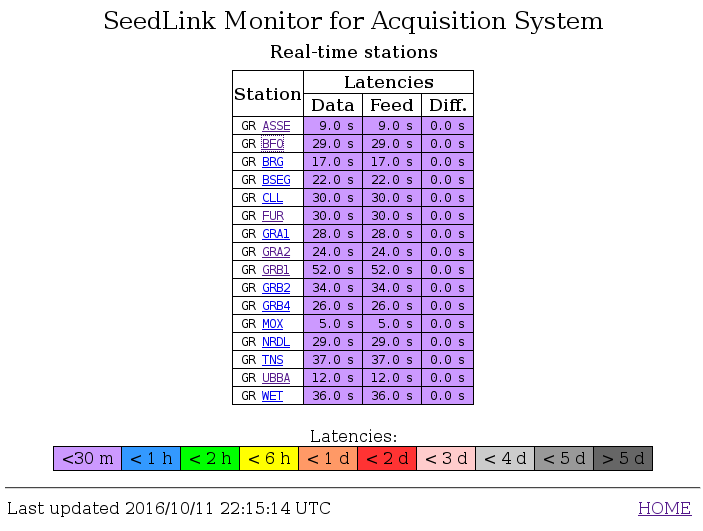
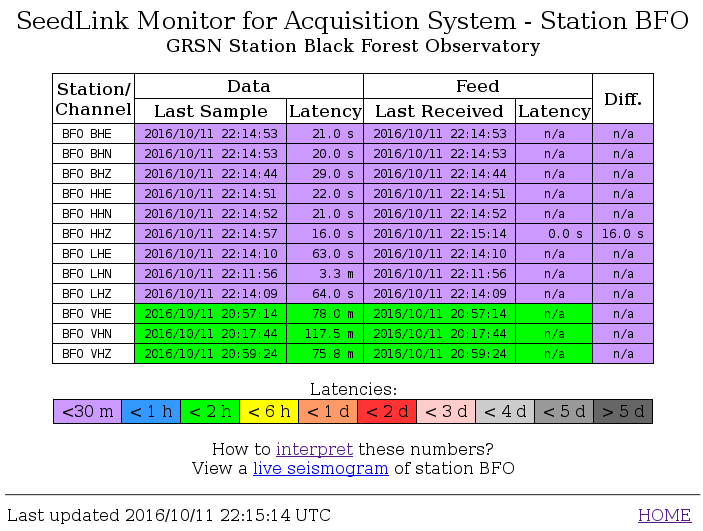

*slmon* collects waveform QC parameters from a configured :ref:`seedlink` Server
and creates static HTML websites for their visualization. :ref:`Station summeries<fig-slmon>` and
:ref:`per-station channels views<fig-slmon-stat>` are available.

Setup
=====

1. Adjust the module configuration parameters of *slmon* to set the seedlink Server,
   the output directory for the created webpages and other parameters.
#. Create and adjust binding profiles and station bindings for *slmon* to activate
   the monitoring of the desired networks and stations.
#. Update the configuration of *slmon*
#. Start *slmon*. This step reads the QC parameters and creates the static webpage.
   The webpage is not automatically updated.

   ..  code-block:: sh

       seiscomp update-config
       seiscomp start slmon

#. Restart *slmon* in order to upate the webpage. The restart can be
   performed by a the regular system check scheduled by a crontab entry.

   The example below shows a crontab entry to update the the webpage
   generated by *slmon* every 3 minutes:

   ..  code-block:: sh

       */3 * * * * /home/sysop/seiscomp3/bin/seiscomp check slmon >/dev/null 2>&1

A comprehensive example for monitoring many stations of a large number of networks
is provided by `GEOFON <http://geofon.gfz-potsdam.de/waveform/status/>`_ at
`GFZ Potsdam <http://www.gfz-potsdam.de>`_, Germany. A simple example of a website
create by *slmon* is given in the :ref:`figures below<fig-slmon>`.

.. _fig-slmon:

   Example of a website with the station summary created by *slmon*.

.. _fig-slmon-stat:

   Example of a website with a per-station channel view created by *slmon*.
