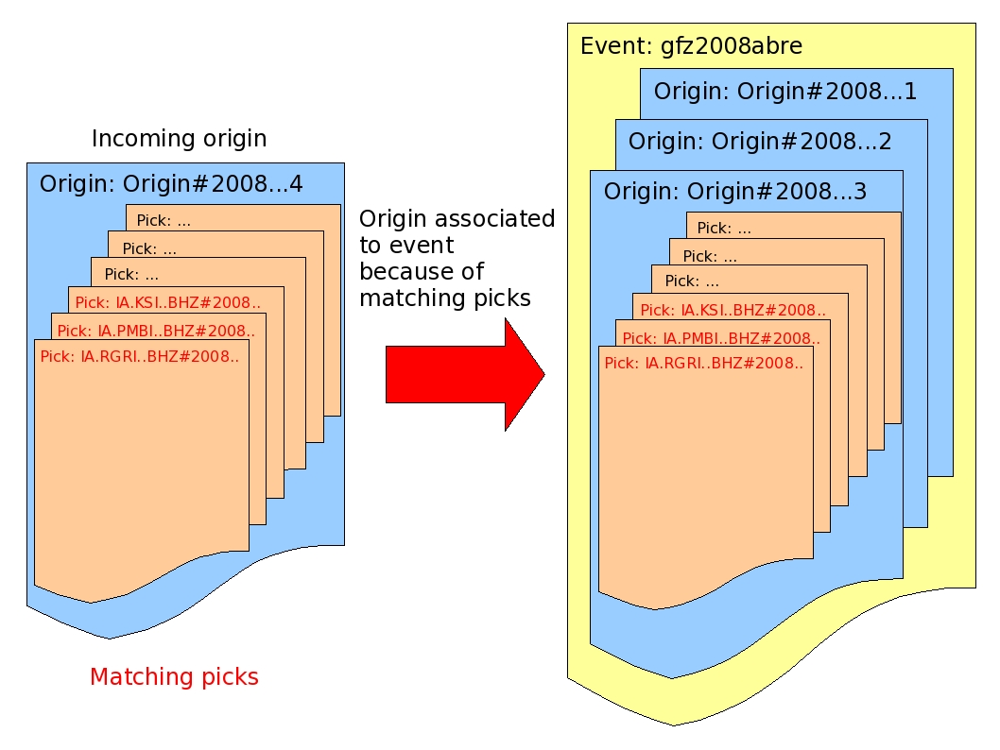

As a consequence of a real-time system the SeisComP3 system creates several
origins (results of localization processes) for one earthquake because as time
goes by more seismic phases are available. scevent receives these origins and
associates the origins to events. It is also possible to import origins from
other agencies.

Origin Matching
---------------

scevent associates origins to events by searching for the best match of the new
(incoming) origin to other origins for existing events. If a match is not found
a new event can be formed. The new origin is matched to existing origins
by comparing differences in the horizontal components of the locations, origin
time difference, and matching picks.
The new origin is matched to an existing origin which has the highest rank in
the following three groups (1, 2, 3):

1. Location and Time (lowest)

   The difference in horizontal location is less than
   :confval:`eventAssociation.maximumDistance` (degrees)
   and the difference in origin times is less than
   :confval:`eventAssociation.maximumTimeSpan`.

2. Picks

   The two origins have more than :confval:`eventAssociation.minimumMatchingArrivals`
   matching picks. Picks are matched either by ID or by time depending
   on :confval:`eventAssociation.maximumMatchingArrivalTimeDiff`.

3. Picks and Location and Time (highest)

   This is the best match, for which both the location-and-time and picks
   criteria above are satisfied.

If more than one origin is found in the highest ranking class, then the first
one of them is chosen.

.. note::

   For efficiency events in the cache are scanned first and if no matches are found
   the database is scanned for the time window :confval:`eventAssociation.eventTimeBefore` - :confval:`eventAssociation.eventTimeAfter`
   around the incoming Origin time. The cached events are ordered by eventID and
   thus in time.

**No Origin Match**

If no event with an origin that matches the incoming origin is found then a
new event is formed and the origin is associated to that event. The following
criteria are applied to allow the creation of the new event:

The agency for the origin is not black listed (processing.blacklist.agencies).

and

If the origin is an automatic then it has more than eventAssociation.minimumDefiningPhases picks.

    Associations of an origin to an event by matching picks.
