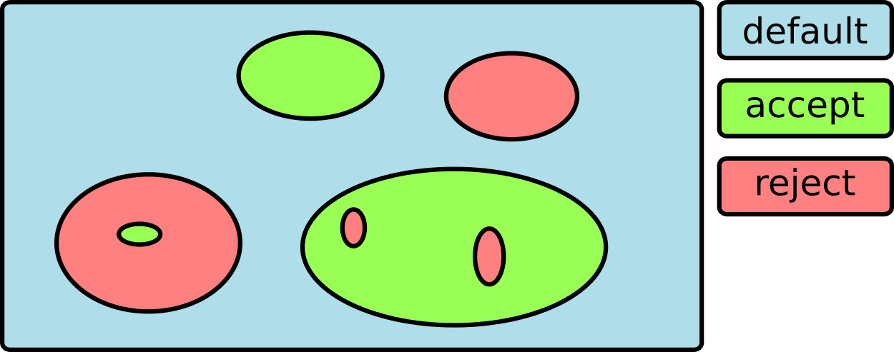

*evrc* is a plug-in for :ref:`scevent`. It sets the event type according to the
location of an event by comparing the event coordinates with regions
By default it sets the event type to "outside of network interest" if the event is
within a defined region.

Events for which the type has been set manually are not treated.

Definition of regions
=====================

Regions are defined by :confval:`names <rc.regions>` of closed polygons provided as
:ref:`BNA files <global_gui>` in @CONFIGDIR@/bna/ or @DATADIR@/bna/.
Events are evaluated based on their location with respect to the regions.

There exist **positive and negative regions**.
Areas enclosed by a polygon are positive regions, areas outside the polygone are negative.
However, if the :confval:`name <rc.regions>` of the enclosing polygon starts with **!** (exclamation mark),
the enclosed region is negative and outside is positive.

If a list of region names is defined, the last matching region in the list takes priority.

Treatment of events
===================

When the *evrc* plug-in is loaded and configured, the locations of the preferred origins
of events are compared with the defined regions.
Events within a positive and a negative region are flagged positive and negative, respectively.

#. When activating :confval:`rc.readEventTypeFromBNA` the type of positive events is set according
   to the eventType defined in :ref:`BNA headers <sec-evrc-bna>`.
   The type of negative events is set according to :confval:`rc.eventTypeNegative`.
   Prepend 'accept' to the list of polygons to unse the type of negative events.
#. When :confval:`rc.readEventTypeFromBNA` is inactive, the event type is set
   based on :confval:`rc.eventTypePositive` and :confval:`rc.eventTypeNegative`:

   #. By default the type of all negative events (events within negative regions) is set to "outside of network interest".
      Prepend **accept** to :confval:`rc.regions` to unset the event type for negative events.

   #. **Positive:** The event type of positive events is set to :confval:`rc.eventTypePositive`.
      For emptpy :confval:`rc.eventTypePositive` the type is unset.

   #. **Negative:** The event type of negative events is set to :confval:`rc.eventTypeNegative`.
      The default type for negative events is "outside of network interest".

Evaluation is made based on the order of the regions names defined in :confval:`rc.regions`.
The last matching criteria applies.
In this way disjunct and overlapping regions with different behavior can be defined.
If events ARE NOT within positive regions their type is set to "outside of network interest".

.. _fig-evrc-region:

  Disjunct and overlapping regions in front of a default.

Event types
===========

The event types are either set based the types configured in :confval:`rc.eventTypePositive` and :confval:`rc.eventTypeNegative`
or based on the type provided by the header of BNA polygons if :confval:`rc.readEventTypeFromBNA` is active.

Type definition
---------------

For defining the event type, any value defined in `QuakeML <https://geofon.gfz-potsdam.de/_uml/>`_.
The list of valid values can also be found in the Event tab of :ref:`scolv`: Type.

Examples for valid event types:

* earthquake
* quarry blast
* nuclear explosion
* not existing
* ...

Invalid values result in errors which are reported depending on the verbosity level of :ref:`scevent`.

.. _sec-evrc-bna:

Event type from BNA
-------------------

If :confval:`rc.readEventTypeFromBNA` is active, the event type is read from the header of
the. Use a key-value pair in double quotes to specify the type where the key is "eventType"
and the type is the value. Key and value are separated by ":".

Example BNA file:

.. code-block:: sh

   "coal","rank 1","eventType: mining explosion",6
   13.392,50.3002
   13.2244,50.4106
   13.4744,50.5347
   13.6886,50.4945
   13.6089,50.358
   13.6089,50.358

where the name of the polygon / region is "coal" and the considered event type
is "mining explosion". The name and the rank are mandatory fields.

Configuration
=============

Load the *evrc* plug-in by adding to the global configuration or to the
global configuration of :ref:`scevent`:

.. code-block:: sh

   plugins = ${plugins},evrc

Add bna polygons by defining :confval:`rc.regions`.
Use the region name to defined regions of acceptance and region names with
leading *!* to define regions within which events are set to "outside of network interest".

.. code-block:: sh

   rc.regions = accept,!area

.. note::

   :ref:`scevent` stops
   if the *evrc* plug-in is loaded but :confval:`rc.regions` is not defined.

Activate :confval:`rc.readEventTypeFromBNA` and add the eventType key-value pair to the
header of the :ref:`BNA polygon <sec-evrc-bna>` if the event type shall be read from the BNA polygon.

Examples
========

Set type events within the polygon **germany** to positive events but do not change
the type outside:

.. code-block:: sh

   rc.regions = accept,germany

Accept all events without type but set the type for all positve events within the polygon **germany** but consider negative within the polygon **quarries**:

.. code-block:: sh

   rc.regions = accept,germany,!quarries

Accept all events without setting the type but consider negative events within the polygon **germany**
and positive events within the polygon **saxony**:

.. code-block:: sh

   rc.regions = accept,!germany,saxony
