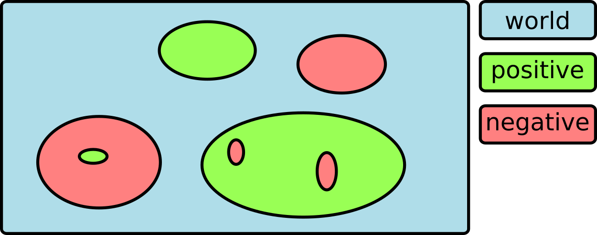

*evrc* is a plug-in for :ref:`scevent`. It sets the event type to "outside of network interest"
by comparing the event location with regions.

Definition of regions
=====================

Regions are defined by closed polygons provided by the
:ref:`bna files <global_gui>` in @CONFIGDIR@/bna/.
They are referred to by the names of the polygons.
The polygons must be closed. Events are evaluated
based on their location with respect to the polygons.
Regions names define areas for which the event type is unset
(not set to "outside of network interest").
Regions names with leading  **!** (exclamation mark) define areas for which
the types of events are set to "outside of network interest".

Treatment of events
===================

When the *evrc* plug-in is loaded and configured then the event locations
are compared with regions enclosed by the defined polygons.

1. By default the type of all events is set to "outside of network interest".
   Use **accept** in :confval:`rc.regions` to overwrite the default.

#. **Acceptance:** Events within regions with names that **DO NOT** have a
   leading **!** (exclamation mark) the event type is unset.

#. **Rejection:** For events within regions with names that have a leading **!** (exclamation mark)
   the event type is set to "outside of network interest".

Evaluation is made based on the order of the regions names defined in :confval:`rc.regions`.
The last matching criteria applies.
In this way disjunct and overlapping regions with different behaviour can be defined.
If events ARE NOT within regions of acceptance or ARE within regions of
rejection their type is set to "outside of network interest".

.. _fig-evrc-region:

  Disjunct and overlapping regions in front of a default.

Configuration
=============

Load the *evrc* plug-in by adding to the global configuration or to the
global configuration of :ref:`scevent`:

.. code-block:: sh

   plugins = ${plugins},evrc

Add bna polygons by defining :confval:`rc.regions`.
Use the region name to defined regions of acceptance and region names with
leading *!* to define regions within which events are set to "outside of network interest".

.. code-block:: sh

   rc.regions = accept,!quarries

.. note::

   :ref:`scevent` stops
   if the *evrc* plug-in is loaded but :confval:`rc.regions` is not defined.

Examples
========

Accept events within the polygon **germany**:

.. code-block:: sh

   rc.regions = germany

Accept all events but reject events within the polygon **quarries**:

.. code-block:: sh

   rc.regions = accept,!quarries

Accept only events within the polygon **germany** but reject events within the polygon **quarries**:

.. code-block:: sh

   rc.regions = germany,!quarries

Accept all events but reject events within the polygon **germany** and accept events within the polygon **saxony**:

.. code-block:: sh

   rc.regions = accept,!germany,saxony
