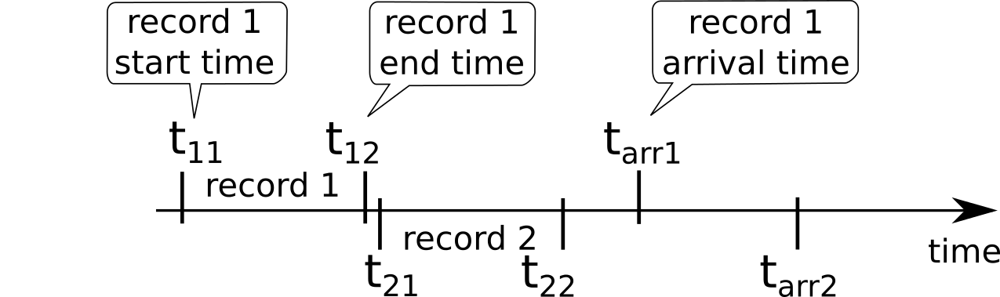

scqc determines waveform quality control (QC) parameters of data streams. The output parameters
are time averaged in terms of waveform quality messages.
In regular intervals report messages are sent containing the short term average
representation of the specific QC parameter for a given time span. Alarm messages
are generated if the short term average (e.g. 90 s) of a QC parameter differs from
the long term average (e.g. 3600 s) by more than a defined threshold.
To avoid an excessive load, QC messages are sent distributed over time. Storing
QC parameters into the database should be avoided by configuring, e.g., :confval:`plugins.default.archive.interval`
as otherwise the database grows quickly.

The QC parameters can be interactively observed using :ref:`scqcv` or :ref:`scmm`.

Technology
==========

scqc uses plugins to compute the waveform QC parameters. The plugins can be found in
@DATADIR@/plugins/qc.

QC parameters
=============

.. _scqc-fig-times:

   Times describing the data records, e.g., for calculating
   :ref:`delay<scqc-delay>` or :ref:`latency<scqc-latency>`.

The following QC parameters are determined:

.. _scqc-availability:

availability [%]
 **Plugin:** qcplugin_availability

 **Description:** Availability of data in the configured time span.

.. _scqc-delay:

delay [s]
 **Plugin:** qcplugin_delay

 **Description:** Time difference between arrival time of last record at the SeisComP3 system
 and end time of last record (see :ref:`Figure<scqc-fig-times>`):

 .. math::

   delay = t_{arr1} - t_{12}.

.. _scqc-gaps:

gap (count [counts], interval [s], length [s])
 **Plugin:** qcplugin_spike

 **Description:** In case of a data gap between two consecutive records this parameter delivers
 the gap interval time, the mean length of the gaps and the number
 of the gaps (count) over the configured time interval.

.. _scqc-latency:

latency [s]
 **Plugin:** qcplugin_latency

 **Description:** Time difference between the end times of consecutive records (see :ref:`Figure<scqc-fig-times>`):

 .. math::

   latency = t_{arr2} - t_{arr1}.

 For constant and low delays, latency is approximately the mean record length.

.. _scqc-offset:

offset [counts]
 **Plugin:** qcplugin_offset

 **Description:** Average value of all samples of a record.

.. _scqc-outage:

outage [time string]
 **Plugin:** qcplugin_outage

 **Description:** Delivers the start and the end time of a data outage (gap).

.. _scqc-overlap:

overlap (count [counts], interval [s], length [s])
  **Plugin:** qcplugin_overlap

  **Description:** In case of overlaps between two consecutive records this parameter delivers
  the overlaps interval time, the mean length of the overlaps and the number
  of the overlaps (count) over the configured time interval.

.. _scqc-rms:

rms [counts]
 **Plugin:** qcplugin_rms

 **Description:** Offset corrected root mean square (RMS) value of a record.

.. _scqc-spike:

spike (count [counts], interval [s], amplitude [counts])
 **Plugin:** qcplugin_spike

 **Description:** In case of the occurrence of a spike in a record this parameter delivers the
 time interval between adjacent spikes, the mean amplitude of the spike and the number
 of the spikes (count) over the configured time interval.
 Internally a list of spikes is stored (spike time, spike amplitude); the spike
 finder algorithm is still preliminary.

.. _scqc-timing:

timing [%]
 **Plugin:** qcplugin_timing

 **Description:** miniSEED record timing quality (0 - 100 %) as written into the miniSEED records
 by the digitizer.
