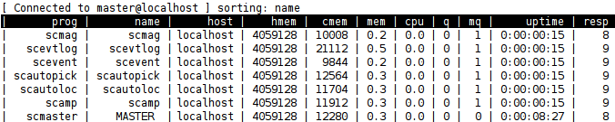

The output is a table where each row contains the information of a
certain connected client. The rows are sorted in descending order based on the
contents of the name column. Other columns can be interactively selected with
the left and right arrow key. The r key changes the sorting to ascending order.
The displayed parameter are the name of the binary (prog), the name of the
client (name), the name of the host name from which the client is connected
(host), the available memory on the clients host in kb (hmem), the clients
memory usage in kb (cmem), the percentage of the clients memory usage (mem),
the CPU usage (cpu), the amount of queued messages to be processed by the
client (q), the average number of messages in the queue (mq), the connection
time of the client to the master (uptime), the elapsed time since the last
client update (resp).

   top like perspective of ncurses plugin

Plugin
======

The Ncurses plugin is installed under :file:`share/plugins/monitor/mncursesplugin.so`.

To add the plugin to :ref:`scm`, add it to the plugin list:

.. code-block:: sh

   plugins = ${plugins}, mncursesplugin

